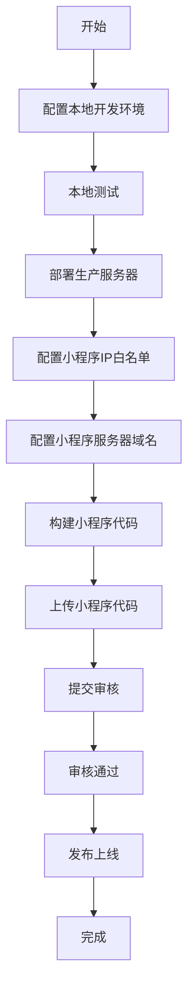

# 部署文档

> **AITY VIP 项目部署指南**
>
> 本目录包含项目的完整部署文档，涵盖本地开发、生产部署、小程序发布等所有环节。

---

## 文档索引

### 快速开始

| 文档 | 说明 | 适用场景 |
|------|------|----------|
| [本地开发环境配置](./local-setup.md) | 本地开发环境搭建 | 开发者初次配置本地环境 |
| [环境配置说明](./configuration.md) | 环境变量和配置详解 | 理解配置结构和环境切换 |

### 生产部署

| 文档 | 说明 | 适用场景 |
|------|------|----------|
| [服务器部署指南](./server-deployment.md) | 生产服务器部署完整流程 | 首次部署或重新部署服务器 |
| [小程序部署指南](./miniprogram-deployment.md) | 微信小程序发布流程 | 小程序上传、审核、发布 |

---

## 部署流程

### 首次部署流程



### 环境架构

```
┌─────────────────────────────────────────────────────────────────────────┐
│                           环境架构                                       │
├─────────────────────────────────────────────────────────────────────────┤
│                                                                         │
│  开发环境 (本地)                                                        │
│  ├── 前端: localhost:5173 / 192.168.2.140:5173                         │
│  ├── 后端: localhost:3001                                               │
│  └── 数据库: aity_vip (本地测试库)                                      │
│                                                                         │
│  ─────────────────────────────────────────────────────────────────────  │
│                                                                         │
│  生产环境 (服务器)                                                      │
│  ├── 前端: 微信小程序 / https://aity88.online                           │
│  ├── 后端: https://aity88.online:8443/api                              │
│  └── 数据库: 投研图灵室 (124.221.119.134)                               │
│                                                                         │
└─────────────────────────────────────────────────────────────────────────┘
```

---

## 快速参考

### 本地开发

```bash
# 启动后端
cd backend
npm install
node src/index.js

# 启动前端（H5）
cd aity-uni-app-v2
npm install
npm run dev:h5

# 启动前端（小程序）
npm run dev:mp-weixin
```

### 生产部署

```bash
# 连接服务器
ssh root@aity88.online

# 部署后端
cd /var/www/aity-vip/backend
npm install --production
pm2 restart aity-backend

# 构建前端
cd /var/www/aity-vip/aity-uni-app-v2
npm run build:h5

# 上传小程序
cd D:\your-mcp-proxy\AITY_VIP\aity-uni-app-v2
npm run upload:weixin
```

---

## 关键配置信息

### 服务器信息

| 配置项 | 值 |
|--------|-----|
| **域名** | aity88.online |
| **HTTPS端口** | 8443 |
| **API地址** | https://aity88.online:8443/api |
| **SSH** | ssh root@aity88.online |

### 数据库信息

| 配置项 | 开发环境 | 生产环境 |
|--------|----------|----------|
| **主机** | localhost | 124.221.119.134 |
| **端口** | 3306 | 3306 |
| **用户** | root | fl |
| **密码** | your_password | fl10b312 |
| **数据库** | aity_vip | 投研图灵室 |

### 小程序信息

| 配置项 | 值 |
|--------|-----|
| **AppID** | wxb16a33cdd58f05d3 |
| **登录邮箱** | 13545023884@163.com |
| **小程序名称** | VIP投研内部分享 |

---

## 测试账号

| 用户名 | 密码 | 角色 | 用途 |
|--------|------|------|------|
| admin | 123456 | 超级管理员 | 测试所有功能 |
| subadmin | 123456 | 子管理员 | 测试管理功能 |
| vip_mid_user | 123456 | 中线用户 | 测试中线内容 |
| vip_short_user | 123456 | 短线用户 | 测试短线内容 |
| trial_user | 123456 | 试用用户 | 测试基础功能 |

---

## 常见问题快速解决

### 1. 小程序无法连接后端

**检查清单**:
- [ ] 后端服务是否运行（`pm2 status`）
- [ ] IP白名单是否配置（微信公众平台）
- [ ] 服务器域名是否配置（微信公众平台）
- [ ] API地址是否正确（`https://aity88.online:8443/api`）

### 2. 本地测试失败

**检查清单**:
- [ ] 后端服务是否启动（`localhost:3001`）
- [ ] 前端服务是否启动（`localhost:5173`）
- [ ] 数据库是否连接正常
- [ ] 本机IP是否正确（`ipconfig`）

### 3. 部署失败

**检查清单**:
- [ ] 服务器连接是否正常（SSH）
- [ ] 环境变量是否配置正确
- [ ] 依赖是否安装完整
- [ ] 数据库是否初始化

---

## 维护命令

### 服务器监控

```bash
# 查看后端服务状态
pm2 status

# 查看后端日志
pm2 logs aity-backend

# 查看Nginx状态
systemctl status nginx

# 查看Nginx日志
tail -f /var/log/nginx/aity-vip-error.log
```

### 数据库备份

```bash
# 手动备份
mysqldump -u fl -pfl10b312 投研图灵室 > backup_$(date +%Y%m%d).sql

# 恢复备份
mysql -u fl -p 投研图灵室 < backup_20260305.sql
```

### 日志清理

```bash
# PM2日志
pm2 flush

# Nginx日志
rm /var/log/nginx/aity-vip-*.log
systemctl restart nginx
```

---

## 版本更新

### 版本号规则

采用语义化版本（Semantic Versioning）：

```
主版本号.次版本号.修订号 (MAJOR.MINOR.PATCH)

例：1.0.0
├── 1: 主版本号（不兼容的API修改）
├── 0: 次版本号（向下兼容的功能性新增）
└── 0: 修订号（向下兼容的问题修正）
```

### 更新流程

1. **修改代码**并本地测试
2. **更新版本号**（package.json）
3. **提交Git记录**
4. **构建前端**：`npm run build:mp-weixin`
5. **上传小程序**：`npm run upload:weixin`
6. **部署后端**：`pm2 restart aity-backend`
7. **提交审核**

---

## 环境切换

### 前端环境自动切换

| 命令 | NODE_ENV | 连接的后端 | 数据库 |
|------|----------|-----------|--------|
| `npm run dev:mp-weixin` | development | 本地后端 | 测试库 |
| `npm run build:mp-weixin` | production | 生产服务器 | 生产库 |

### 手动切换环境

**后端**:
```bash
# 开发环境
NODE_ENV=development node src/index.js

# 生产环境
NODE_ENV=production node src/index.js
```

**前端**:
```bash
# 开发环境
npm run dev:h5

# 生产环境
npm run build:h5
```

---

## 安全检查清单

### 部署前检查

- [ ] 环境变量已正确配置
- [ ] 敏感信息已提交到 .gitignore
- [ ] SSL证书已配置且有效
- [ ] 数据库密码已更新
- [ ] JWT_SECRET已设置为强密码
- [ ] 防火墙规则已配置
- [ ] SSH密钥已配置

### 发布前检查

- [ ] 所有功能测试通过
- [ ] 性能测试通过
- [ ] 代码已审查
- [ ] 文档已更新
- [ ] 备份已完成

---

## 相关资源

### 官方文档

- [uni-app 官方文档](https://uniapp.dcloud.net.cn/)
- [微信小程序官方文档](https://developers.weixin.qq.com/miniprogram/dev/framework/)
- [Node.js 官方文档](https://nodejs.org/docs/)
- [PM2 官方文档](https://pm2.keymetrics.io/docs/)

### 工具下载

- [Node.js 下载](https://nodejs.org/)
- [微信开发者工具下载](https://developers.weixin.qq.com/miniprogram/dev/devtools/download.html)
- [VS Code 下载](https://code.visualstudio.com/Download)
- [Git 下载](https://git-scm.com/downloads)

---

## 技术支持

### 获取帮助

1. **查看文档**: 先查阅相关部署文档
2. **检查日志**: 查看控制台或日志文件
3. **搜索问题**: 使用搜索引擎搜索错误信息
4. **查阅社区**: GitHub Issues、Stack Overflow

### 联系方式

- **邮箱**: 13545023884@163.com
- **项目**: AITY VIP

---

## 文档维护

**文档版本**: v1.0.0
**最后更新**: 2026-03-05
**维护团队**: AITY VIP Team

---

## 变更记录

| 版本 | 日期 | 变更内容 |
|------|------|----------|
| v1.0.0 | 2026-03-05 | 初始版本，整合所有部署文档 |

---

**祝部署顺利！** 🚀
