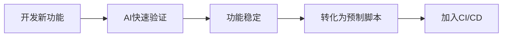

# 自动化测试工作流程指南

> 本文档定义项目自动化测试的完整工作流程，帮助团队成员理解如何高效使用测试工具
>
> **最后更新**: 2026-02-28
> **适用项目**: AITY VIP

---

## 一、测试策略概述

### 1.1 分层测试策略

```
┌─────────────────────────────────────────────────────┐
│  Level 4: E2E 测试 (预制脚本)                        │
│  - 核心业务流程（登录、密码修改、消息发布）            │
│  - CI/CD 自动执行                                   │
│  - 文件位置: tests/e2e/*.spec.ts                    │
├─────────────────────────────────────────────────────┤
│  Level 3: 集成测试 (预制脚本)                        │
│  - API 接口测试                                     │
│  - 模块间交互                                       │
│  - 文件位置: tests/api/*.spec.ts                   │
├─────────────────────────────────────────────────────┤
│  Level 2: 探索性测试 (AI临时生成)                    │
│  - 新功能快速验证                                    │
│  - Bug 复现与验证                                   │
│  - 使用 Dev Browser 内联脚本                        │
├─────────────────────────────────────────────────────┤
│  Level 1: 单元测试 (预制脚本)                        │
│  - 函数/组件级别                                    │
│  - 开发者编写                                       │
│  - 文件位置: tests/unit/*.spec.ts                  │
└─────────────────────────────────────────────────────┘
```

### 1.2 测试方式对比

| 方式 | 适用场景 | 优点 | 缺点 |
|------|----------|------|------|
| **预制脚本** | 核心流程、CI/CD | 稳定、可复用 | 维护成本高 |
| **AI临时生成** | 探索性测试、快速验证 | 灵活、快速 | 不可复用 |
| **混合模式** | 大多数场景 | 兼顾两者 | 需要管理 |

---

## 二、Dev Browser 工具说明

### 2.1 什么是 Dev Browser

Dev Browser 是一个基于 Playwright 的浏览器自动化工具，提供：

- **浏览器控制**: 启动、导航、点击、输入
- **AI快照**: 智能识别页面元素，生成稳定的选择器
- **状态持久化**: 页面状态在脚本间保持

### 2.2 核心API

```typescript
import { connect, waitForPageLoad } from "@/client.js";

// 连接浏览器服务
const client = await connect();

// 获取/创建命名页面（状态持久化）
const page = await client.page("test-name");

// 导航
await page.goto("http://localhost:5173");
await waitForPageLoad(page);

// AI快照 - 智能识别页面元素
const snapshot = await client.getAISnapshot("test-name");
console.log(snapshot);
// 输出: textbox [ref=e17], button [ref=e30] ...

// 使用快照引用操作元素
const btn = await client.selectSnapshotRef("test-name", "e30");
await btn.click();

// 断开连接（页面保留）
await client.disconnect();
```

### 2.3 与标准 Playwright 的区别

| 特性 | 标准Playwright | Dev Browser |
|------|---------------|-------------|
| 浏览器生命周期 | 每次启动新浏览器 | 浏览器持久运行 |
| 页面状态 | 脚本结束后销毁 | **页面状态保留** |
| AI快照 | 无 | **支持智能识别** |
| 调试能力 | 需重新运行 | 可随时连接查看 |

---

## 三、uni-app 测试常见问题与解决方案

### 3.1 uni-mask 遮罩层拦截问题

**问题描述**: uni-app 的模态框会生成遮罩层，拦截点击事件。

**错误示例**:
```
<div class="uni-mask"></div> intercepts pointer events
```

**解决方案**:
```typescript
// 方案1: 使用 force 选项强制点击
await locator.click({ force: true });

// 方案2: 使用 Playwright 直接定位
const btn = page.locator('text=确定').first();
await btn.click({ force: true });
```

### 3.2 组件选择器兼容性问题

**问题描述**: uni-app 组件不渲染为标准HTML元素。

**解决方案**: 使用 AI 快照引用
```typescript
// 获取快照
const snapshot = await client.getAISnapshot("page-name");

// 使用快照中的元素引用
const loginBtn = await client.selectSnapshotRef("page-name", "e30");
await loginBtn.click();
```

---

## 四、日常工作流程

### 4.1 新功能开发



**步骤说明**:

1. **开发新功能** - 完成代码开发
2. **AI快速验证** - 使用 Dev Browser 内联脚本快速验证
   ```bash
   cd ~/.claude/skills/dev-browser && npx tsx <<'EOF'
   import { connect, waitForPageLoad } from "@/client.js";
   const client = await connect();
   const page = await client.page("quick-test");
   // ... 快速验证代码
   await client.disconnect();
   EOF
   ```
3. **功能稳定** - 功能通过测试，准备固化
4. **转化为预制脚本** - 将验证代码保存为 `.spec.ts` 文件
5. **加入CI/CD** - 集成到自动化流水线

### 4.2 Bug 修复验证

```bash
# 1. 启动 Dev Browser
cd ~/.claude/skills/dev-browser
./server.sh

# 2. 在另一个终端执行验证脚本
cd ~/.claude/skills/dev-browser && npx tsx <<'EOF'
import { connect } from "@/client.js";
const client = await connect();
const page = await client.page("bug-verify");
// 复现Bug步骤
await page.goto("http://localhost:5173");
// ... 验证代码
await client.disconnect();
EOF
```

### 4.3 回归测试

```bash
# 运行预制测试脚本
cd aity-uni-app-v2
npx playwright test tests/e2e/

# 生成报告
npx playwright show-report
```

---

## 五、测试脚本存放位置

### 5.1 目录结构

```
项目目录/
├── aity-uni-app-v2/
│   └── tests/                      # Playwright 预制测试
│       ├── e2e/                    # E2E测试
│       │   ├── login.spec.ts
│       │   └── password.spec.ts
│       └── api/                    # API测试
│
├── docs/testing/                   # 测试文档
│   ├── 自动化测试工作流程指南.md    # 本文档
│   ├── uni-app自动化测试最佳实践.md # 最佳实践
│   ├── DevBrowser使用指南.md       # Dev Browser 使用
│   └── test-cases.md               # 测试用例
│
└── ~/.claude/skills/dev-browser/
    └── tmp/                        # 临时测试脚本
        ├── quick-test.ts           # 快速验证脚本
        └── *.png                   # 测试截图
```

### 5.2 脚本命名规范

| 类型 | 命名规范 | 示例 |
|------|----------|------|
| E2E测试 | `{功能}.spec.ts` | `login.spec.ts` |
| API测试 | `{模块}-api.spec.ts` | `user-api.spec.ts` |
| 临时验证 | `{日期}-{功能}-test.ts` | `20260228-password-test.ts` |

---

## 六、最佳实践总结

### 6.1 核心原则

1. **核心流程必须有预制脚本** - 登录、密码修改、核心业务
2. **新功能先用AI验证** - 快速、灵活
3. **稳定后转化为预制脚本** - 可复用、可追溯
4. **保留测试文档和报告** - 便于回溯

### 6.2 Dev Browser 使用技巧

```typescript
// 1. 优先使用AI快照
const snapshot = await client.getAISnapshot("page-name");
const element = await client.selectSnapshotRef("page-name", "e17");

// 2. 弹窗处理用 force
const btn = page.locator('text=确定').first();
await btn.click({ force: true });

// 3. 小步验证，及时截图
await page.screenshot({ path: "tmp/step-1.png" });

// 4. 每步操作后获取快照确认状态
const newSnapshot = await client.getAISnapshot("page-name");
```

### 6.3 常见问题自查清单

- [ ] 是否使用了 `force: true` 处理弹窗？
- [ ] 是否使用了 AI 快照代替 CSS 选择器？
- [ ] 是否在关键步骤添加了截图？
- [ ] 是否等待了页面加载完成？
- [ ] 是否设置了合理的超时时间？

---

## 七、相关文档

| 文档 | 位置 | 说明 |
|------|------|------|
| [DevBrowser使用指南](DevBrowser使用指南.md) | docs/testing/ | Dev Browser 详细使用 |
| [uni-app最佳实践](uni-app自动化测试最佳实践.md) | docs/testing/ | uni-app 测试技巧 |
| [测试用例](test-cases.md) | docs/testing/ | 功能测试用例 |
| [测试账户](测试账户参考.md) | docs/testing/ | 测试账号信息 |

---

**文档维护**: AITY VIP Team
**最后更新**: 2026-02-28
