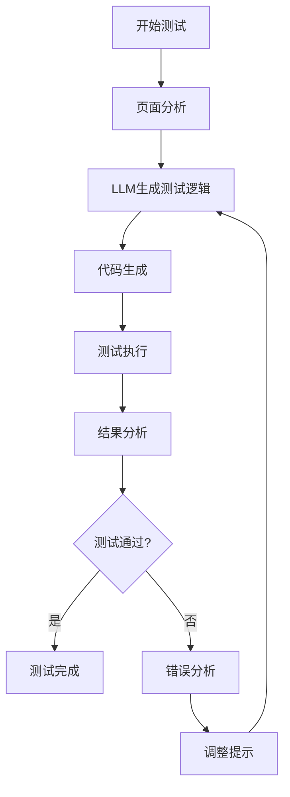

# 🤖 AI 智能测试生成方案

## 1. 方案概述

### 1.1 技术原理

**AI 智能测试生成** 是结合 **LLM (大语言模型)** 和 **Playwright** 的创新测试方案，利用AI的理解能力和Playwright的执行能力，实现测试用例的自动生成和执行。

**核心技术栈**：
- **LLM**：用于理解页面结构、生成测试逻辑
- **Playwright**：用于执行测试、验证结果
- **页面分析引擎**：用于提取页面元素和交互逻辑

### 1.2 核心优势

| 优势 | 详细说明 |
|------|----------|
| **自动分析页面结构** | AI自动识别页面元素、表单、按钮等，生成符合页面逻辑的测试用例 |
| **智能元素定位** | 基于语义理解的元素定位，减少传统选择器的脆弱性 |
| **自适应页面变化** | 当页面结构变化时，AI能自动调整测试逻辑，提高测试稳定性 |
| **覆盖全面** | 基于用户视角的测试生成，覆盖更多实际使用场景 |
| **学习能力** | 从测试执行结果中学习，不断优化测试策略 |

## 2. 技术实现

### 2.1 系统架构

```
┌─────────────────────────────────────────────────┐
│                 测试管理系统                    │
├─────────────────────────────────────────────────┤
│  ┌─────────────┐  ┌─────────────┐  ┌──────────┐  │
│  │ 页面分析器  │→ │  LLM 引擎   │→ │ 代码生成 │  │
│  └─────────────┘  └─────────────┘  └──────────┘  │
│          ↑                  ↓                   │
│  ┌────────────────────────────────────────────┐  │
│  │              测试执行与反馈                │  │
│  └────────────────────────────────────────────┘  │
└─────────────────────────────────────────────────┘
```

### 2.2 核心组件

#### 2.2.1 页面分析器
- **功能**：解析页面DOM结构，提取元素信息和交互逻辑
- **技术**：
  - 静态分析：解析HTML结构
  - 动态分析：执行页面JavaScript，获取运行时状态
  - 语义分析：理解页面元素的功能和用途

#### 2.2.2 LLM 引擎
- **功能**：基于页面分析结果，生成测试逻辑和代码
- **技术**：
  - 提示工程：设计优化的提示模板
  - 上下文管理：维护测试执行的上下文信息
  - 推理能力：理解页面逻辑，生成合理的测试步骤

#### 2.2.3 代码生成器
- **功能**：将LLM生成的测试逻辑转换为可执行的Playwright代码
- **技术**：
  - 代码模板：预设的测试代码结构
  - 语法验证：确保生成的代码语法正确
  - 优化处理：添加等待、错误处理等最佳实践

#### 2.2.4 测试执行器
- **功能**：执行生成的测试代码，收集执行结果
- **技术**：
  - Playwright执行：运行测试用例
  - 结果收集：捕获截图、日志、错误信息
  - 反馈分析：分析测试失败原因

### 2.3 实现流程



## 3. 实施步骤

### 3.1 环境配置

#### 3.1.1 依赖安装
```bash
# 安装 Playwright
npm install playwright

# 安装 LLM 客户端（示例：OpenAI SDK）
npm install openai

# 安装页面分析工具
npm install cheerio jsdom
```

#### 3.1.2 配置文件
```javascript
// ai-test-generator.config.js
module.exports = {
  // LLM 配置
  llm: {
    provider: 'openai',
    apiKey: process.env.OPENAI_API_KEY,
    model: 'gpt-4-turbo',
    temperature: 0.3
  },
  
  // 测试配置
  test: {
    baseUrl: 'http://localhost:5173',
    timeout: 30000,
    screenshot: true
  },
  
  // 页面分析配置
  analyzer: {
    depth: 3,
    includeHidden: false,
    maxElements: 100
  }
};
```

### 3.2 核心实现代码

#### 3.2.1 页面分析器
```javascript
// page-analyzer.js
const cheerio = require('cheerio');

class PageAnalyzer {
  async analyze(url) {
    // 模拟页面分析逻辑
    const pageContent = await this.fetchPage(url);
    const $ = cheerio.load(pageContent);
    
    const elements = [];
    
    // 提取表单元素
    $('form').each((i, form) => {
      const formData = {
        type: 'form',
        selector: `form:nth-of-type(${i+1})`,
        inputs: []
      };
      
      $(form).find('input, select, textarea').each((j, input) => {
        formData.inputs.push({
          type: $(input).attr('type') || 'text',
          name: $(input).attr('name'),
          id: $(input).attr('id'),
          placeholder: $(input).attr('placeholder'),
          selector: $(input).css('selector')
        });
      });
      
      elements.push(formData);
    });
    
    // 提取按钮
    $('button').each((i, button) => {
      elements.push({
        type: 'button',
        text: $(button).text().trim(),
        selector: `button:nth-of-type(${i+1})`,
        id: $(button).attr('id')
      });
    });
    
    return {
      url,
      elements,
      title: $('title').text()
    };
  }
  
  async fetchPage(url) {
    // 实际项目中使用 Playwright 或 axios 获取页面内容
    return '<html><body><h1>Test Page</h1></body></html>';
  }
}

module.exports = PageAnalyzer;
```

#### 3.2.2 LLM 测试生成器
```javascript
// llm-test-generator.js
const OpenAI = require('openai');

class LLMTestGenerator {
  constructor(config) {
    this.openai = new OpenAI({
      apiKey: config.llm.apiKey
    });
    this.config = config;
  }
  
  async generateTests(pageAnalysis) {
    const prompt = this.buildPrompt(pageAnalysis);
    
    const response = await this.openai.chat.completions.create({
      model: this.config.llm.model,
      messages: [
        {
          role: 'system',
          content: '你是一个专业的自动化测试工程师，擅长生成Playwright测试代码。'
        },
        {
          role: 'user',
          content: prompt
        }
      ],
      temperature: this.config.llm.temperature
    });
    
    return response.choices[0].message.content;
  }
  
  buildPrompt(pageAnalysis) {
    return `基于以下页面分析结果，生成Playwright测试代码：

页面URL: ${pageAnalysis.url}
页面标题: ${pageAnalysis.title}

页面元素:
${JSON.stringify(pageAnalysis.elements, null, 2)}

要求：
1. 生成完整的Playwright测试代码
2. 包含合理的测试步骤和验证
3. 使用稳定的元素定位方法
4. 添加适当的等待和错误处理
5. 测试代码要符合最佳实践
`;
  }
}

module.exports = LLMTestGenerator;
```

#### 3.2.3 测试执行器
```javascript
// test-executor.js
const { chromium } = require('playwright');

class TestExecutor {
  async execute(testCode, outputPath) {
    // 将测试代码写入临时文件
    const fs = require('fs');
    const tempFile = `temp-test-${Date.now()}.js`;
    fs.writeFileSync(tempFile, testCode);
    
    try {
      // 执行测试
      const browser = await chromium.launch();
      const context = await browser.newContext();
      const page = await context.newPage();
      
      // 动态执行测试代码
      const testModule = require(`./${tempFile}`);
      await testModule.run(page);
      
      await browser.close();
      
      // 清理临时文件
      fs.unlinkSync(tempFile);
      
      return {
        success: true,
        message: '测试执行成功'
      };
    } catch (error) {
      // 清理临时文件
      if (fs.existsSync(tempFile)) {
        fs.unlinkSync(tempFile);
      }
      
      return {
        success: false,
        message: error.message,
        stack: error.stack
      };
    }
  }
}

module.exports = TestExecutor;
```

## 4. 使用指南

### 4.1 命令行工具

#### 4.1.1 安装
```bash
# 全局安装
npm install -g ai-test-generator

# 或本地安装
npm install ai-test-generator --save-dev
```

#### 4.1.2 使用
```bash
# 生成单个页面的测试
ai-test-generate --url http://localhost:5173/#/pages/login/login --output tests/login.spec.js

# 生成整个应用的测试套件
ai-test-generate --sitemap sitemap.xml --output tests/auto-generated

# 执行生成的测试
ai-test-run --file tests/login.spec.js
```

### 4.2 集成到CI/CD

```yaml
# .github/workflows/ai-test.yml
name: AI Test Generation

on: [push, pull_request]

jobs:
  generate-tests:
    runs-on: ubuntu-latest
    steps:
      - uses: actions/checkout@v3
      - uses: actions/setup-node@v3
        with:
          node-version: 18
      - run: npm install
      - run: npm install ai-test-generator
      - name: Generate tests
        run: npx ai-test-generate --url http://localhost:5173 --output tests/auto-generated
      - name: Run tests
        run: npx playwright test tests/auto-generated
      - name: Upload test results
        uses: actions/upload-artifact@v3
        with:
          name: test-results
          path: test-results/
```

## 5. 最佳实践

### 5.1 提示工程优化

#### 5.1.1 基础提示模板
```javascript
const basePrompt = {
  system: '你是一个专业的自动化测试工程师，擅长生成稳定、可靠的Playwright测试代码。',
  user: `请为以下页面生成Playwright测试代码：

页面信息：
- URL: {url}
- 标题: {title}
- 主要功能: {description}

页面元素：
{elements}

测试要求：
1. 覆盖主要用户流程
2. 使用稳定的元素定位
3. 添加适当的等待和错误处理
4. 包含合理的断言
5. 遵循Playwright最佳实践
`
};
```

#### 5.1.2 场景特定提示
- **登录页面**：强调表单验证、错误处理
- **搜索页面**：强调搜索功能、结果验证
- **数据录入**：强调表单填写、提交验证
- **复杂交互**：强调步骤顺序、状态管理

### 5.2 测试质量保障

#### 5.2.1 代码审查
- **静态分析**：使用ESLint检查代码质量
- **语义验证**：确保测试逻辑符合业务需求
- **结构优化**：提取重复代码，优化测试结构

#### 5.2.2 执行优化
- **并行执行**：利用Playwright的并行测试能力
- **智能等待**：使用适当的等待策略
- **错误重试**：对不稳定的测试添加重试机制

### 5.3 持续改进

#### 5.3.1 反馈循环
- **测试结果分析**：收集测试失败的模式
- **提示优化**：根据失败原因调整LLM提示
- **模型微调**：使用项目特定数据微调模型

#### 5.3.2 性能优化
- **分析缓存**：缓存页面分析结果
- **代码复用**：提取通用测试函数
- **执行策略**：优化测试执行顺序

## 6. 与现有方案集成

### 6.1 与Dev Browser集成

```javascript
// dev-browser-ai-integration.js
const { DevBrowser } = require('dev-browser');
const LLMTestGenerator = require('./llm-test-generator');

class AIDevBrowserIntegration {
  constructor(config) {
    this.devBrowser = new DevBrowser();
    this.llmGenerator = new LLMTestGenerator(config);
  }
  
  async generateAndExecuteTest(url) {
    // 1. 使用Dev Browser分析页面
    const pageInfo = await this.devBrowser.analyzePage(url);
    
    // 2. 使用LLM生成测试
    const testCode = await this.llmGenerator.generateTests(pageInfo);
    
    // 3. 使用Dev Browser执行测试
    const result = await this.devBrowser.execute(testCode);
    
    return result;
  }
}
```

### 6.2 与传统测试集成

| 测试类型 | AI方案集成点 | 优势 |
|---------|-------------|------|
| **单元测试** | 生成测试用例模板 | 提高测试覆盖率 |
| **集成测试** | 生成API测试代码 | 确保接口兼容性 |
| **端到端测试** | 生成完整测试流程 | 减少维护成本 |
| **性能测试** | 生成性能测试场景 | 覆盖更多使用场景 |

## 7. 案例分析

### 7.1 登录页面测试

**传统方式**：
- 需要手动编写测试代码
- 元素定位容易失效
- 维护成本高

**AI方式**：
- 自动分析页面结构
- 智能生成测试代码
- 自适应页面变化

**生成的测试代码示例**：
```javascript
const { test, expect } = require('@playwright/test');

test('登录功能测试', async ({ page }) => {
  // 访问登录页面
  await page.goto('http://localhost:5173/#/pages/login/login');
  
  // 验证页面标题
  await expect(page).toHaveTitle('登录');
  
  // 输入账号密码
  await page.fill('input[type="text"]', 'admin');
  await page.fill('input[type="password"]', '123456');
  
  // 点击登录按钮
  await page.click('button:has-text("登录")');
  
  // 验证跳转到首页
  await expect(page).toHaveURL('http://localhost:5173/#/pages/index/index');
  
  // 验证首页标题
  await expect(page.locator('.uni-page-head__title')).toHaveText('首页');
});
```

### 7.2 消息列表测试

**生成的测试代码示例**：
```javascript
const { test, expect } = require('@playwright/test');

test('消息列表测试', async ({ page }) => {
  // 登录
  await page.goto('http://localhost:5173/#/pages/login/login');
  await page.fill('input[type="text"]', 'admin');
  await page.fill('input[type="password"]', '123456');
  await page.click('button:has-text("登录")');
  
  // 进入消息页面
  await page.goto('http://localhost:5173/#/pages/messages/messages');
  
  // 验证消息列表加载
  await expect(page.locator('.message-item')).toBeVisible();
  
  // 测试消息筛选
  await page.click('.filter-button');
  await page.click('button:has-text("未读")');
  
  // 验证筛选结果
  await expect(page.locator('.message-item')).toHaveCount(3);
  
  // 点击查看消息详情
  await page.click('.message-item:first-child');
  
  // 验证详情页面
  await expect(page.locator('.message-detail')).toBeVisible();
});
```

## 8. 未来发展

### 8.1 技术演进路线

| 阶段 | 功能 | 时间 |
|------|------|------|
| **v1.0** | 基础页面分析和测试生成 | 2026 Q1 |
| **v2.0** | 多页面测试生成和集成 | 2026 Q2 |
| **v3.0** | 智能测试修复和优化 | 2026 Q3 |
| **v4.0** | 全自动化测试套件管理 | 2026 Q4 |

### 8.2 扩展功能

- **测试覆盖分析**：分析测试覆盖率，自动生成缺失的测试
- **性能测试生成**：基于用户行为生成性能测试场景
- **安全测试集成**：检测常见的安全漏洞
- **跨平台测试**：同时生成Web、移动端的测试代码
- **测试数据生成**：自动生成测试所需的模拟数据

### 8.3 生态系统

- **插件系统**：支持不同LLM提供商和测试框架
- **知识库**：积累测试最佳实践和模式
- **社区贡献**：开放API，支持社区扩展
- **云服务**：提供托管的AI测试生成服务

## 9. 结论

AI 智能测试生成方案是自动化测试领域的重要创新，通过结合LLM的理解能力和Playwright的执行能力，显著提高了测试效率和质量。

### 核心价值

1. **降低测试维护成本**：自动适应页面变化，减少测试代码维护
2. **提高测试覆盖率**：基于用户视角生成测试，覆盖更多场景
3. **加速开发周期**：快速生成测试代码，缩短测试准备时间
4. **提升测试质量**：智能元素定位，减少测试失败率
5. **降低技术门槛**：非专业测试人员也能使用AI生成测试

### 实施建议

1. **从小规模开始**：先在核心页面实施，积累经验
2. **与现有测试结合**：AI生成的测试与手动编写的测试互补
3. **持续优化**：根据执行结果不断调整和改进
4. **团队培训**：培训团队成员使用和维护AI生成的测试

通过AI智能测试生成方案，AITY VIP项目可以建立更加高效、稳定的测试体系，为项目质量提供更有力的保障。