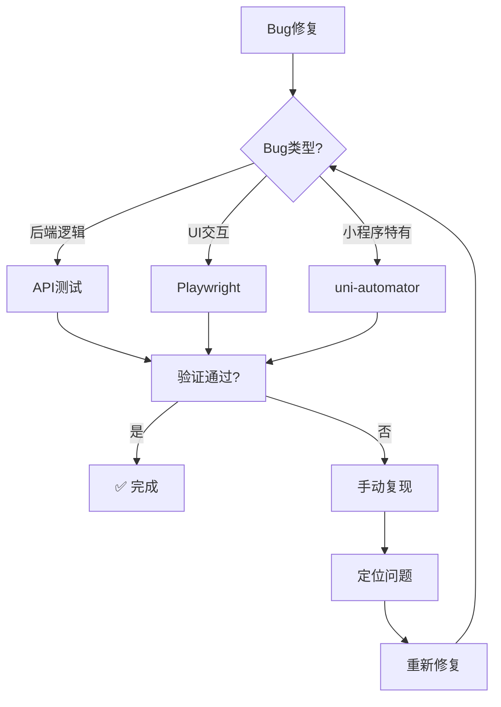
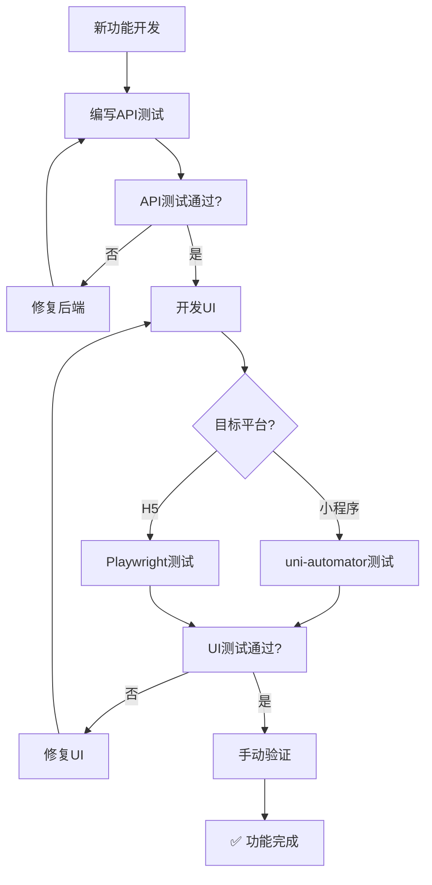
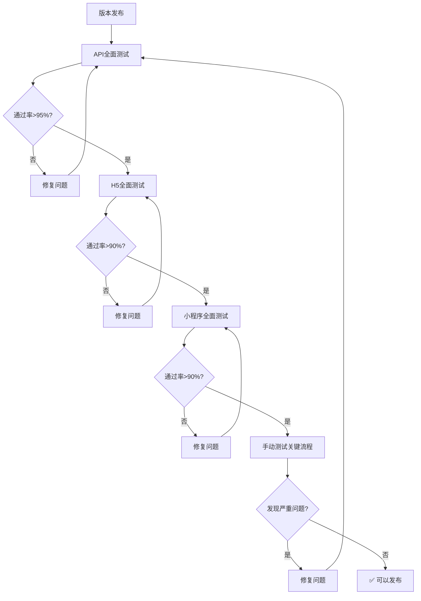

# 🎯 自动化测试方案选择指南

## ⚡ 快速决策树

```
开始测试
    │
    ├─ 需要验证什么？
    │   │
    │   ├─ 后端API功能？
    │   │   └─> 🎯 使用【API测试】（2分钟）
    │   │       bash tests/api/api-quick-test.sh
    │   │
    │   ├─ 小程序功能？
    │   │   └─> 🎯 使用【uni-automator】（5分钟）
    │   │       node tests/miniprogram/automated-test.js
    │   │
    │   ├─ H5 Web功能？
    │   │   ├─ 已有测试代码？
    │   │   │   ├─ 是 ─> 🎯 使用【Playwright】（3分钟）
    │   │   │   │       npx playwright test
    │   │   │   │
    │   │   │   └─ 否 ─> 🎯 使用【Skill + Dev Browser】（10分钟）
    │   │   │           1. 用Playwright Skill生成代码
    │   │   │           2. 用Dev Browser执行
    │   │   │           3. 固化测试代码
    │   │   │
    │   └─ 用户体验和边缘情况？
    │       └─> 🎯 使用【手动测试】（15分钟）
    │           按照手动测试清单验证
    │
    └─ 全平台完整验证？
        └─> 🎯 使用【组合方案】（30分钟）
            1. API测试
            2. 小程序测试
            3. H5测试
            4. 手动补充
```

---

## 📊 方案对比速查表

### 按测试目标选择

| 测试目标 | 首选方案 | 备选方案 | 执行命令 |
|---------|---------|---------|---------|
| **后端接口** | API测试 | Postman | `bash tests/api/api-quick-test.sh` |
| **小程序UI** | uni-automator | 手动测试 | `node tests/miniprogram/automated-test.js` |
| **H5界面** | Playwright | Skill+Dev Browser | `npx playwright test` |
| **登录功能** | API测试 | Playwright | 先API验证，再UI测试 |
| **收藏功能** | API测试 + uni-automator | 手动测试 | API验证修复，UI验证交互 |
| **行情功能** | API测试 + Playwright | 手动测试 | API验证数据，UI验证权限 |
| **权限控制** | Playwright | 手动测试 | 自动化验证跳转逻辑 |

---

### 按时间限制选择

| 可用时间 | 推荐方案 | 测试范围 |
|---------|---------|---------|
| **< 3分钟** | API测试 | 核心API端点 |
| **3-10分钟** | API + uni-automator | 后端 + 小程序核心功能 |
| **10-20分钟** | API + Playwright | 后端 + H5核心功能 |
| **20-30分钟** | 全自动化组合 | 后端 + H5 + 小程序 |
| **> 30分钟** | 全方案 + 手动 | 完整测试覆盖 |

---

### 按项目阶段选择

| 项目阶段 | 推荐方案 | 说明 |
|---------|---------|------|
| **开发中** | API测试 + 手动 | 快速反馈，灵活调整 |
| **功能测试** | uni-automator + Playwright | 自动化验证功能 |
| **回归测试** | 全自动化组合 | 确保没有回归问题 |
| **版本发布** | 全方案 + 手动 | 最全面的质量保证 |
| **CI/CD** | Playwright + API | 自动化流水线 |

---

## 🔧 具体场景决策

### 场景1: 修复Bug后的验证



**执行步骤**:
1. 根据Bug类型选择测试方案
2. 运行对应的测试
3. 验证是否修复
4. 如未修复，手动复现问题
5. 定位并修复后重新测试

---

### 场景2: 新功能开发



**执行步骤**:
1. 先完成API开发和测试
2. 再开发UI界面
3. 根据平台选择UI测试方案
4. 最后手动验证用户体验
5. 确认功能完成

---

### 场景3: 版本发布前测试



**执行步骤**:
1. 后端API全面测试（要求>95%通过）
2. H5界面全面测试（要求>90%通过）
3. 小程序全面测试（要求>90%通过）
4. 手动测试关键业务流程
5. 确认无严重问题后发布

---

## 📋 常见问题决策

### Q1: 浏览器还没下载完怎么办？
**决策**: 优先使用 API测试 和 uni-automator
```bash
# 方案A: API测试（立即可用）
bash tests/api/api-quick-test.sh

# 方案B: 小程序测试（立即可用）
node tests/miniprogram/automated-test.js

# 方案C: 手动测试（立即可用）
在微信开发者工具中打开项目手动验证
```

---

### Q2: uni-automator连接失败怎么办？
**决策**: 检查配置或改用手动测试
```bash
# 步骤1: 检查微信开发者工具
"/c/Program Files (x86)/Tencent/微信web开发者工具/cli.bat" islogin

# 步骤2: 如未连接，开启服务端口
# 微信开发者工具 → 设置 → 安全设置 → 开启服务端口

# 步骤3: 如仍失败，改用手动测试
# 在微信开发者工具中打开 dist/dev/mp-weixin 手动测试
```

---

### Q3: 测试代码生成不准确怎么办？
**决策**: 调整用例描述或改用Playwright直接编写
```bash
# 方案A: 优化提示语
# 更精准地描述测试步骤和预期结果

# 方案B: 直接编写测试代码
# 使用Playwright语法手动编写测试代码

# 方案C: 使用录制工具
# Playwright提供代码录制功能
npx playwright codegen http://localhost:5173
```

---

### Q4: 时间不够做完整测试怎么办？
**决策**: 优先级测试策略
```bash
# 优先级1: 后端核心API（3分钟）
- 健康检查
- 登录API
- 修复的Bug相关API

# 优先级2: 修复的功能（5分钟）
- 收藏功能（消息和讨论）
- 行情权限控制
- 自动刷新机制

# 优先级3: 核心业务流程（7分钟）
- 登录流程
- 消息浏览
- 讨论交互

# 省略项: 次要功能和UI细节
```

---

## 🎯 推荐工作流

### 日常开发工作流（推荐）
```
1. 修改代码
   ↓
2. API测试验证（2分钟）
   bash tests/api/api-quick-test.sh
   ↓
3. 手动验证修改的功能（3分钟）
   ↓
4. 提交代码
```

---

### 完整测试工作流
```
1. 后端测试
   ├─ API测试（2分钟）
   └─ 数据库验证（1分钟）
   ↓
2. 前端测试
   ├─ 小程序自动化（5分钟）
   ├─ H5自动化（5分钟）
   └─ 手动测试（10分钟）
   ↓
3. 集成测试
   └─ 完整业务流程（5分钟）
   ↓
4. 生成测试报告
   └─ 汇总测试结果
```

---

## 📚 相关文档

| 文档 | 路径 | 说明 |
|------|------|------|
| 方案对比总览 | `docs/automation-test-solutions-comparison.md` | 所有方案详细对比 |
| Skill+DevBrowser方案 | `docs/Skill-DevBrowser-自动化测试方案.md` | AI辅助测试方案 |
| 通用测试方案 | `docs/通用-小程序与H5自动化测试技术方案.md` | 传统测试方案 |
| 手动测试指南 | `docs/miniprogram-manual-test-guide.md` | 手动测试清单 |
| 完整测试报告 | `docs/complete-test-report.md` | 测试执行报告 |

---

## 💡 使用建议

1. **把这个文档加入书签** - 方便快速查找合适的测试方案
2. **根据场景选择** - 不要固定使用一种方案，灵活组合
3. **持续优化** - 根据实际情况调整测试策略
4. **记录经验** - 记录每种方案的优缺点和适用场景

---

**记住**: 没有"最好"的测试方案，只有"最适合当前场景"的方案！
