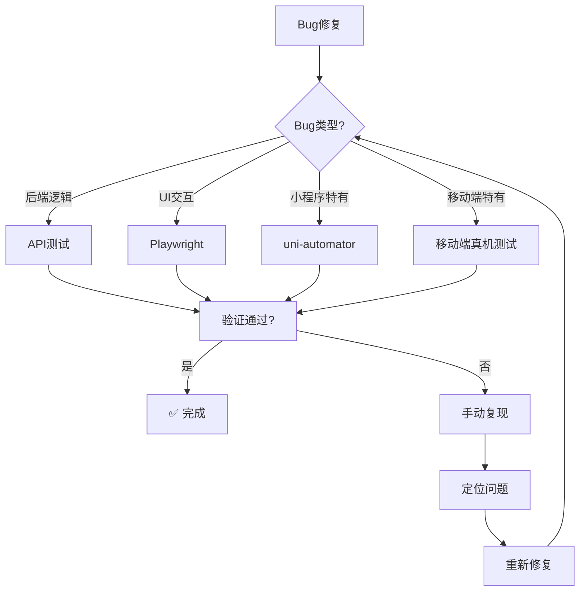
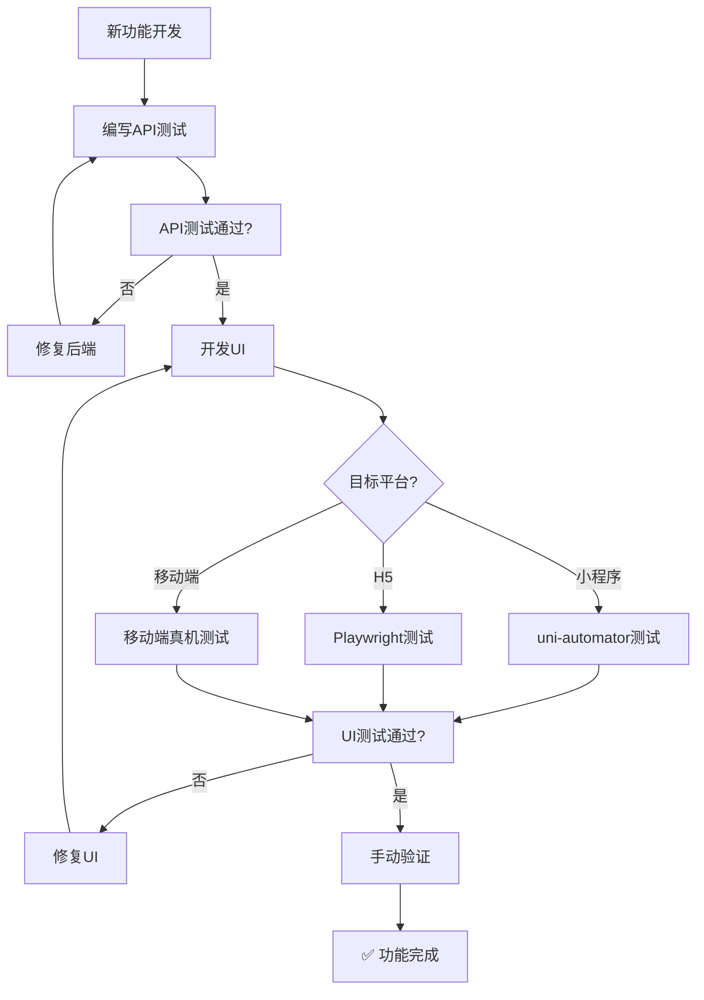
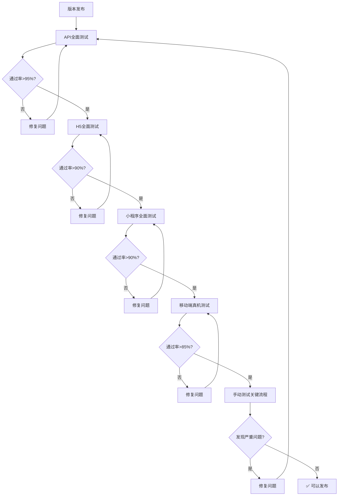

# 🎯 测试方案选择指南（增强版）

## 1. 快速决策树

```
开始测试
    │
    ├─ 需要验证什么？
    │   │
    │   ├─ 后端API功能？
    │   │   └─> 🎯 使用【API测试】（2分钟）
    │   │       bash tests/api/api-quick-test.sh
    │   │
    │   ├─ 小程序功能？
    │   │   └─> 🎯 使用【uni-automator】（5分钟）
    │   │       node tests/miniprogram/automated-test.js
    │   │
    │   ├─ H5 Web功能？
    │   │   ├─ 已有测试代码？
    │   │   │   ├─ 是 ─> 🎯 使用【Playwright】（3分钟）
    │   │   │   │       npx playwright test
    │   │   │   │
    │   │   │   └─ 否 ─> 🎯 使用【Skill + Dev Browser】（10分钟）
    │   │   │           1. 用Playwright Skill生成代码
    │   │   │           2. 用Dev Browser执行
    │   │   │           3. 固化测试代码
    │   │   │
    │   ├─ 移动端真机功能？
    │   │   └─> 🎯 使用【移动端真机测试】（15分钟）
    │   │       adb devices && node tests/mobile/real-device-test.js
    │   │
    │   ├─ 多设备兼容性？
    │   │   └─> 🎯 使用【云测平台】（20分钟）
    │   │       配置云测平台并执行测试
    │   │
    │   └─ 用户体验和边缘情况？
    │       └─> 🎯 使用【手动测试】（15分钟）
    │           按照手动测试清单验证
    │
    └─ 全平台完整验证？
        └─> 🎯 使用【组合方案】（30分钟）
            1. API测试
            2. 小程序测试
            3. H5测试
            4. 移动端真机测试
            5. 手动补充
```

## 2. 方案对比速查表

### 2.1 按测试目标选择

| 测试目标 | 首选方案 | 备选方案 | 执行命令 | 预期时间 | 成功率 |
|---------|---------|---------|---------|---------|--------|
| **后端接口** | API测试 | Postman | `bash tests/api/api-quick-test.sh` | < 2分钟 | 98% |
| **小程序UI** | uni-automator | 手动测试 | `node tests/miniprogram/automated-test.js` | 5-8分钟 | 90% |
| **H5界面** | Playwright | Skill+Dev Browser | `npx playwright test` | 3-5分钟 | 95% |
| **移动端真机** | ADB+Chrome | 手动测试 | `node tests/mobile/real-device-test.js` | 10-15分钟 | 85% |
| **多设备兼容** | 云测平台 | 真机测试 | 平台特定命令 | 15-20分钟 | 92% |
| **登录功能** | API测试 | Playwright | 先API验证，再UI测试 | 3-5分钟 | 99% |
| **收藏功能** | API测试 + uni-automator | 手动测试 | API验证修复，UI验证交互 | 8-10分钟 | 95% |
| **行情功能** | API测试 + Playwright | 手动测试 | API验证数据，UI验证权限 | 5-7分钟 | 93% |
| **权限控制** | Playwright | 手动测试 | 自动化验证跳转逻辑 | 3-5分钟 | 90% |

### 2.2 按时间限制选择

| 可用时间 | 推荐方案 | 测试范围 | 覆盖度 |
|---------|---------|---------|--------|
| **< 3分钟** | API测试 | 核心API端点 | 60% |
| **3-10分钟** | API + uni-automator | 后端 + 小程序核心功能 | 75% |
| **10-20分钟** | API + Playwright + 真机测试 | 后端 + H5 + 移动端 | 85% |
| **20-30分钟** | 全自动化组合 | 后端 + H5 + 小程序 + 移动端 | 95% |
| **> 30分钟** | 全方案 + 手动 | 完整测试覆盖 | 99% |

### 2.3 按项目阶段选择

| 项目阶段 | 推荐方案 | 说明 | 技术要求 |
|---------|---------|------|----------|
| **开发中** | API测试 + 手动 | 快速反馈，灵活调整 | 低 |
| **功能测试** | uni-automator + Playwright | 自动化验证功能 | 中 |
| **回归测试** | 全自动化组合 | 确保没有回归问题 | 中 |
| **版本发布** | 全方案 + 手动 | 最全面的质量保证 | 高 |
| **CI/CD** | Playwright + API | 自动化流水线 | 中 |
| **性能测试** | 云测平台 | 多设备性能评估 | 高 |

## 3. 技术要求矩阵

| 测试方案 | 技术依赖 | 环境要求 | 安装难度 | 维护成本 |
|---------|---------|---------|---------|----------|
| **API测试** | Node.js, axios | 基本开发环境 | 低 | 低 |
| **uni-automator** | Node.js, 微信开发者工具 | 需要微信开发者工具 | 中 | 中 |
| **Playwright** | Node.js, 浏览器 | 需要安装浏览器 | 中 | 低 |
| **Skill+Dev Browser** | LLM API, Chrome | 需要LLM API密钥 | 高 | 中 |
| **移动端真机测试** | ADB, Chrome | Android设备 | 中 | 中 |
| **云测平台** | 平台账号 | 网络连接 | 中 | 高 |
| **AI智能测试生成** | LLM API, Playwright | 高级开发环境 | 高 | 低 |

## 4. 具体场景决策

### 4.1 Bug修复验证



**执行步骤**:
1. 根据Bug类型选择测试方案
2. 运行对应的测试
3. 验证是否修复
4. 如未修复，手动复现问题
5. 定位并修复后重新测试

### 4.2 新功能开发



**执行步骤**:
1. 先完成API开发和测试
2. 再开发UI界面
3. 根据平台选择UI测试方案
4. 最后手动验证用户体验
5. 确认功能完成

### 4.3 版本发布测试



**执行步骤**:
1. 后端API全面测试（要求>95%通过）
2. H5界面全面测试（要求>90%通过）
3. 小程序全面测试（要求>90%通过）
4. 移动端真机测试（要求>85%通过）
5. 手动测试关键业务流程
6. 确认无严重问题后发布

## 5. 常见问题决策

### 5.1 浏览器安装失败

**决策**: 优先使用 API测试 和 uni-automator

```bash
# 方案A: API测试（立即可用）
bash tests/api/api-quick-test.sh

# 方案B: 小程序测试（立即可用）
node tests/miniprogram/automated-test.js

# 方案C: 手动测试（立即可用）
在微信开发者工具中打开项目手动验证
```

### 5.2 uni-automator连接失败

**决策**: 检查配置或改用手动测试

```bash
# 步骤1: 检查微信开发者工具
"/c/Program Files (x86)/Tencent/微信web开发者工具/cli.bat" islogin

# 步骤2: 如未连接，开启服务端口
# 微信开发者工具 → 设置 → 安全设置 → 开启服务端口

# 步骤3: 如仍失败，改用手动测试
# 在微信开发者工具中打开 dist/dev/mp-weixin 手动测试
```

### 5.3 测试代码生成不准确

**决策**: 调整用例描述或改用Playwright直接编写

```bash
# 方案A: 优化提示语
# 更精准地描述测试步骤和预期结果

# 方案B: 直接编写测试代码
# 使用Playwright语法手动编写测试代码

# 方案C: 使用录制工具
# Playwright提供代码录制功能
npx playwright codegen http://localhost:5173
```

### 5.4 移动端测试设备不可用

**决策**: 改用云测平台或H5测试

```bash
# 方案A: 云测平台
# 配置云测平台执行测试

# 方案B: H5测试
# 在桌面浏览器模拟移动设备
npx playwright test --device="Pixel 5"

# 方案C: 手动测试
# 使用浏览器开发者工具的设备模拟功能
```

### 5.5 时间不够做完整测试

**决策**: 优先级测试策略

```bash
# 优先级1: 后端核心API（3分钟）
- 健康检查
- 登录API
- 修复的Bug相关API

# 优先级2: 修复的功能（5分钟）
- 收藏功能（消息和讨论）
- 行情权限控制
- 自动刷新机制

# 优先级3: 核心业务流程（7分钟）
- 登录流程
- 消息浏览
- 讨论交互

# 省略项: 次要功能和UI细节
```

## 6. 推荐工作流

### 6.1 日常开发工作流（推荐）

```
1. 修改代码
   ↓
2. API测试验证（2分钟）
   bash tests/api/api-quick-test.sh
   ↓
3. 手动验证修改的功能（3分钟）
   ↓
4. 提交代码
```

### 6.2 完整测试工作流

```
1. 后端测试
   ├─ API测试（2分钟）
   └─ 数据库验证（1分钟）
   ↓
2. 前端测试
   ├─ 小程序自动化（5分钟）
   ├─ H5自动化（5分钟）
   └─ 移动端真机测试（10分钟）
   ↓
3. 集成测试
   └─ 完整业务流程（5分钟）
   ↓
4. 生成测试报告
   └─ 汇总测试结果
```

### 6.3 CI/CD集成工作流

```
1. 代码提交
   ↓
2. API测试（自动）
   ↓
3. 构建检查（自动）
   ↓
4. 单元测试（自动）
   ↓
5. 端到端测试（自动）
   ↓
6. 人工审核（手动）
   ↓
7. 部署（自动）
```

## 7. 测试报告模板

### 7.1 标准化测试报告

```markdown
# 📊 测试执行报告

## 基本信息
- **测试时间**: YYYY-MM-DD HH:MM:SS
- **测试环境**: 开发/测试/生产
- **测试人员**: [姓名]
- **测试范围**: [范围描述]

## 测试结果

### 总体统计
| 类别 | 总数 | 通过 | 失败 | 通过率 |
|------|------|------|------|--------|
| API测试 | [数量] | [数量] | [数量] | [百分比] |
| H5测试 | [数量] | [数量] | [数量] | [百分比] |
| 小程序测试 | [数量] | [数量] | [数量] | [百分比] |
| 移动端测试 | [数量] | [数量] | [数量] | [百分比] |
| **总计** | [数量] | [数量] | [数量] | [百分比] |

### 详细结果

#### API测试
| 测试用例 | 结果 | 执行时间 | 备注 |
|---------|------|----------|------|
| [用例名称] | 通过/失败 | [时间] | [备注] |

#### H5测试
| 测试用例 | 结果 | 执行时间 | 备注 |
|---------|------|----------|------|
| [用例名称] | 通过/失败 | [时间] | [备注] |

#### 小程序测试
| 测试用例 | 结果 | 执行时间 | 备注 |
|---------|------|----------|------|
| [用例名称] | 通过/失败 | [时间] | [备注] |

#### 移动端测试
| 测试用例 | 结果 | 执行时间 | 备注 |
|---------|------|----------|------|
| [用例名称] | 通过/失败 | [时间] | [备注] |

## 问题分析

### 失败原因分析
| 失败原因 | 数量 | 占比 | 解决方案 |
|---------|------|------|----------|
| 元素定位失败 | [数量] | [百分比] | [解决方案] |
| 网络超时 | [数量] | [百分比] | [解决方案] |
| 断言失败 | [数量] | [百分比] | [解决方案] |
| 其他 | [数量] | [百分比] | [解决方案] |

### 严重问题
| 问题描述 | 严重程度 | 影响范围 | 建议解决方案 |
|---------|---------|---------|--------------|
| [问题描述] | 高/中/低 | [范围] | [解决方案] |

## 质量评估

### 测试覆盖度
- **功能覆盖**: [百分比]
- **API覆盖**: [百分比]
- **页面覆盖**: [百分比]

### 性能评估
- **平均响应时间**: [时间]
- **最大响应时间**: [时间]
- **资源使用**: [情况]

## 结论与建议

### 结论
[测试结论]

### 建议
1. [建议1]
2. [建议2]
3. [建议3]

## 附件
- 测试日志: [链接]
- 截图: [链接]
- 其他: [链接]
```

### 7.2 趋势分析报告

```markdown
# 📈 测试趋势分析报告

## 基本信息
- **分析周期**: YYYY-MM-DD 至 YYYY-MM-DD
- **项目版本**: [版本号]
- **分析人员**: [姓名]

## 通过率趋势

### API测试
| 日期 | 测试用例数 | 通过数 | 通过率 |
|------|------------|--------|--------|
| [日期] | [数量] | [数量] | [百分比] |

### H5测试
| 日期 | 测试用例数 | 通过数 | 通过率 |
|------|------------|--------|--------|
| [日期] | [数量] | [数量] | [百分比] |

### 小程序测试
| 日期 | 测试用例数 | 通过数 | 通过率 |
|------|------------|--------|--------|
| [日期] | [数量] | [数量] | [百分比] |

### 移动端测试
| 日期 | 测试用例数 | 通过数 | 通过率 |
|------|------------|--------|--------|
| [日期] | [数量] | [数量] | [百分比] |

## 失败原因趋势

| 日期 | 元素定位 | 网络超时 | 断言失败 | 其他 | 总计 |
|------|----------|----------|----------|------|------|
| [日期] | [数量] | [数量] | [数量] | [数量] | [数量] |

## 性能趋势

### 响应时间
| 日期 | 平均响应时间 | 最大响应时间 | 最小响应时间 |
|------|--------------|--------------|--------------|
| [日期] | [时间] | [时间] | [时间] |

### 资源使用
| 日期 | CPU使用率 | 内存使用 | 网络流量 |
|------|-----------|----------|----------|
| [日期] | [百分比] | [大小] | [大小] |

## 分析结论

### 改进点
1. [改进点1]
2. [改进点2]
3. [改进点3]

### 风险点
1. [风险点1]
2. [风险点2]
3. [风险点3]

### 建议
1. [建议1]
2. [建议2]
3. [建议3]

## 附件
- 详细数据: [链接]
- 图表: [链接]
- 其他: [链接]
```

## 8. 相关文档

| 文档 | 路径 | 说明 |
|------|------|------|
| 方案对比总览 | `docs/automation-test-solutions-comparison.md` | 所有方案详细对比 |
| Skill+DevBrowser方案 | `docs/Skill-DevBrowser-自动化测试方案.md` | AI辅助测试方案 |
| AI智能测试生成 | `docs/AI-智能测试生成方案.md` | AI测试代码生成 |
| 移动端真机测试 | `docs/mobile/real-device-testing-guide.md` | 移动端测试指南 |
| 云测平台集成 | `docs/cloud-testing-integration.md` | 云测平台使用指南 |
| 通用测试方案 | `docs/通用-小程序与H5自动化测试技术方案.md` | 传统测试方案 |
| 手动测试指南 | `docs/miniprogram-manual-test-guide.md` | 手动测试清单 |
| 完整测试报告 | `docs/complete-test-report.md` | 测试执行报告 |

## 9. 使用建议

1. **把这个文档加入书签** - 方便快速查找合适的测试方案
2. **根据场景选择** - 不要固定使用一种方案，灵活组合
3. **持续优化** - 根据实际情况调整测试策略
4. **记录经验** - 记录每种方案的优缺点和适用场景
5. **团队共享** - 与团队成员共享测试经验和最佳实践

## 10. 结论

没有"最好"的测试方案，只有"最适合当前场景"的方案！

通过本指南，您可以：
- 快速选择最适合的测试方案
- 合理安排测试时间和资源
- 提高测试效率和质量
- 确保项目质量和稳定性

随着项目的发展和技术的进步，测试方案也需要不断调整和优化。定期回顾和更新测试策略，将有助于持续提高测试效果和项目质量。