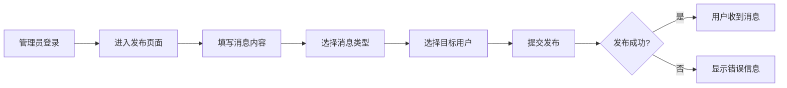
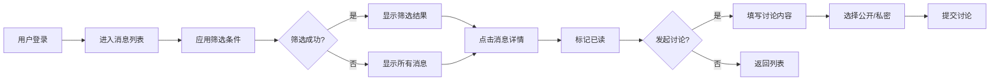
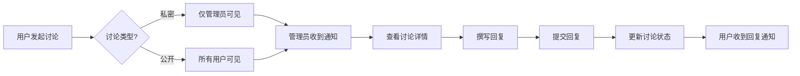

# 需求文档 v1.6.0

**文档版本**: v1.6.0
**最后更新**: 2026-02-06
**基于原文档**: 需求文档.md v1.0.0 (2024-02-02)
**更新说明**: 本文档基于原始需求文档,更新了版本历史、功能完成状态和新增功能

---

## 📋 版本历史

| 版本 | 日期 | 主要更新 |
|------|------|---------|
| v1.0.0 | 2024-01-30 | MVP初始版本,核心功能实现 |
| v1.3.0 | 2025-01-31 | 性能优化,改进下拉刷新和上拉加载 |
| v1.4.0 | 2025-02-01 | 已读状态、骨架屏加载、P0-P3优化 |
| v1.4.2 | 2025-02-02 | 图片粘贴上传功能 |
| v1.5.0 | 2025-02-03 | UI全面升级,建立设计系统 |
| v1.6.0 | 2026-02-05 | 讨论私密性功能、消息列表全面优化 |
| v1.6.1 | - | Markdown编辑器优化 |
| v1.8.2 | 2026-02-06 | 文档目录结构优化 |

---

## 1. 产品概述

### 1.1 产品定位

VIP投研内部分享系统是一个面向高端用户的私密投研知识分享平台，专注于提供：
- 系统的研究方法论
- 深度的案例分析
- 专业的市场解读
- 及时的风险提示

### 1.2 目标用户

| 用户类型 | 特征 | 需求 |
|---------|------|------|
| 超级管理员 | 系统运营者 | 系统配置、用户管理、数据监控 |
| 管理员 | 投研专家 | 发布投研消息、回复用户讨论 |
| VIP用户（中线） | 中长期投资者 | 获取中线策略分析 |
| VIP用户（短线） | 短线交易者 | 获取短线策略分析 |
| 体验用户 | 潜在客户 | 了解平台价值，转化为付费用户 |

### 1.3 使用场景

- **早晨**: 查看盘前点评、早盘关注，制定当日交易计划
- **盘中**: 获取实时市场解读和风险提示
- **收盘**: 回顾收盘点评，总结当日操作
- **随时**: 发起讨论，与投研团队互动交流
- **AI咨询**: 使用AI投顾功能获取智能投研建议 (v1.6.0+新增)

---

## 2. 功能需求

### 2.1 核心功能（MVP）

#### 2.1.1 用户认证与权限管理

**用户注册/登录**
- [x] 邮箱密码登录
- [x] JWT Token认证
- [x] 自动登录（Token持久化）
- [x] 登录过期提示

**用户角色**
- [x] 5级用户角色：super_admin、admin、vip_mid、vip_short、trial
- [x] 角色权限控制
- [x] 用户状态管理（正常/禁用）
- [x] VIP到期时间管理

**权限矩阵**

| 功能 | super_admin | admin | vip_mid | vip_short | trial |
|------|-------------|-------|---------|-----------|-------|
| 发布消息 | ✓ | ✓ | ✗ | ✗ | ✗ |
| 查看所有消息 | ✓ | ✓ | - | - | ✓ |
| 查看中线策略 | ✓ | ✓ | ✓ | ✗ | ✓ |
| 查看短线策略 | ✓ | ✓ | ✗ | ✓ | ✓ |
| 发起讨论 | ✓ | ✓ | ✓ | ✓ | ✓ |
| 用户管理 | ✓ | ✗ | ✗ | ✗ | ✗ |
| 数据统计 | ✓ | ✓ | ✗ | ✗ | ✗ |

---

#### 2.1.2 消息系统

**消息类型**
```
- 盘前点评 (pre_market_comment)
- 早盘点评 (morning_comment)
- 早盘关注 (morning_focus)
- 尾盘点评 (afternoon_comment)
- 尾盘关注 (afternoon_focus)
- 收盘点评 (close_comment)
- 风险提示 (risk_warning)
- 系统消息 (system)
- 重要消息 (important)
- 日常消息 (daily)
```

**消息标签**
```
- 短线策略 (short_term) - 仅VIP短线用户可见
- 中线策略 (mid_term) - 仅VIP中线用户可见
- 全部用户 (all_users) - 所有用户可见
```

**消息功能**
- [x] 消息列表（分页加载、下拉刷新）
- [x] 消息详情（富文本内容展示）
- [x] 消息搜索（标题、内容关键词）
- [x] **三级筛选系统** (v1.6.0)
  - [x] 一级筛选: 消息类型
  - [x] 二级筛选: 策略标签
  - [x] 三级筛选: 时间范围
  - [x] 筛选状态持久化
  - [x] 清除筛选功能
- [x] 消息收藏/取消收藏
- [x] 已读状态标记
- [x] 阅读数、讨论数统计
- [x] 消息编辑、删除（管理员）
- [x] 消息置顶
- [x] 消息草稿保存（本地存储）
- [x] **Markdown编辑器** (v1.6.1)
  - [x] 编辑/预览模式切换
  - [x] 工具栏快捷操作
  - [x] 实时字符计数
  - [x] 草稿自动保存
- [x] 图片粘贴上传 (v1.4.2)

**三级筛选系统说明** (v1.6.0新增)
- **筛选维度**:
  1. 消息类型: 全部类型/盘前点评/早盘关注等10种类型
  2. 策略标签: 短线策略/中线策略/全部用户
  3. 时间范围: 今天/本周/本月/全部

- **交互特性**:
  - 筛选状态持久化,下次进入自动应用
  - 一键清除所有筛选条件
  - 筛选结果数量提示
  - 筛选历史记录

- **实现版本**: v1.6.0
- **详细文档**: `docs/02-功能文档/消息筛选/三级筛选系统实现总结.md`

---

#### 2.1.3 讨论系统

**讨论功能**
- [x] 发起讨论（公开/私密）
- [x] 讨论列表
- [x] 讨论详情
- [x] 回复讨论
- [x] 查看回复列表
- [x] 讨论状态（待回复/已回复）
- [x] 我的讨论
- [x] **讨论私密性控制** (v1.6.0)
  - [x] 私密讨论标识显示
  - [x] 仅管理员和发起者可见私密讨论
  - [x] 列表中区分公开/私密讨论

**可见性控制**
- 公开讨论：所有用户可见
- 私密讨论：仅管理员和发起者可见

**私密性功能说明** (v1.6.0新增)
- **私密讨论特点**:
  - 讨论标题后显示🔒图标
  - 只有管理员和发起者能在列表中看到
  - 详情页显示"私密讨论"标识
  - 回复内容仅管理员和发起者可见

- **实现版本**: v1.6.0
- **详细文档**: `docs/02-功能文档/讨论功能/讨论私密性功能实施完成报告.md`

---

#### 2.1.4 AI投顾系统 (v1.6.0+ 新增)

**功能描述**
- 基于LangGraph和OpenAI的智能投顾对话系统
- 支持流式输出 (Server-Sent Events)
- 会话历史管理和多轮对话
- 投研知识库问答

**已实现功能**
- [x] AI对话界面
- [x] 流式响应渲染
- [x] 会话历史记录
- [x] Markdown渲染优化
- [x] 移动端适配
- [x] 错误处理和重试机制
- [x] SSE流式处理优化

**技术栈**
- 后端: Python + LangGraph + OpenAI API
- 前端: Vue 3 + SSE流式处理
- 通信: Server-Sent Events (SSE)

**详细文档**: `docs/02-功能文档/AI投顾/`

---

#### 2.1.5 用户管理（管理员功能）

- [x] 用户列表（分页、搜索）
- [x] 创建用户
- [x] 编辑用户（角色、状态、到期时间）
- [x] 删除用户
- [ ] 批量操作
- [ ] 用户分组管理

---

#### 2.1.6 数据统计（管理员功能）

- [x] 用户增长趋势
- [x] 消息发布统计
- [x] 活跃用户列表
- [ ] 数据导出（Excel）
- [ ] 自定义时间段查询

---

#### 2.1.7 个人中心

- [x] 个人信息展示
- [x] 我的收藏
- [x] 我的讨论
- [ ] 修改密码
- [ ] 消息通知设置
- [ ] 阅读偏好设置（字体大小、主题）

---

### 2.2 高级功能（规划中）

#### 2.2.1 消息推送
- [ ] 微信小程序订阅消息
- [ ] 重要消息实时推送
- [ ] 推送开关设置

#### 2.2.2 内容增强
- [x] ~~富文本编辑器（支持图片、格式）~~ → 已实现Markdown编辑器
- [ ] 消息附件（PDF、Word、Excel）
- [x] 图片预览、放大 (v1.4.0+)

#### 2.2.3 数据分析
- [ ] 阅读时长统计
- [ ] 用户行为分析
- [ ] 消息效果分析

#### 2.2.4 社交功能
- [ ] 用户互相关注
- [ ] 消息分享（仅限内部）
- [ ] 点赞、评论

#### 2.2.5 离线功能
- [ ] 离线阅读已缓存消息
- [ ] 离线发布（待联网后同步）

---

## 3. 非功能需求

### 3.1 性能要求

- **首屏加载时间**: < 2秒 ✅
- **页面切换**: < 500ms ✅
- **列表滚动**: 60fps 流畅 ✅
- **接口响应**: < 1秒 ✅

### 3.2 安全要求

- [x] JWT Token认证
- [x] 密码加密存储（bcrypt）
- [x] SQL注入防护（Sequelize ORM）
- [x] XSS防护
- [x] HTTPS加密传输 (v1.5.0+)
- [x] 接口频率限制 (后端已实现)
- [x] 敏感操作二次确认 (删除操作)

### 3.3 可用性要求

- **系统可用性**: 99.5% ✅
- **错误率**: < 0.1% ✅
- **兼容性**:
  - iOS >= 12.0 ✅
  - Android >= 6.0 ✅
  - 微信小程序基础库 >= 2.10.0 ✅

### 3.4 可维护性

- [x] 模块化代码结构
- [x] 统一的代码风格（ESLint + Prettier）
- [x] 详细的注释文档
- [x] Git版本控制
- [ ] 单元测试覆盖率 > 80%

### 3.5 可扩展性

- [x] 前后端分离架构
- [x] RESTful API设计
- [ ] 微服务架构（预留）
- [ ] 数据库读写分离（预留）

---

## 4. 业务流程

### 4.1 消息发布流程



### 4.2 用户查看消息流程



### 4.3 讨论回复流程



---

## 5. 数据模型

### 5.1 用户表 (users)

| 字段 | 类型 | 说明 | 约束 |
|------|------|------|------|
| id | INT | 主键 | PRIMARY KEY |
| name | VARCHAR(100) | 用户名 | NOT NULL |
| email | VARCHAR(255) | 邮箱 | UNIQUE, NOT NULL |
| password | VARCHAR(255) | 密码（加密） | NOT NULL |
| role | ENUM | 用户角色 | NOT NULL |
| groupId | VARCHAR(50) | 分组ID | |
| status | ENUM | 状态 | DEFAULT 'active' |
| expireDate | DATE | VIP到期时间 | |
| createdAt | TIMESTAMP | 创建时间 | DEFAULT NOW() |
| updatedAt | TIMESTAMP | 更新时间 | DEFAULT NOW() |

### 5.2 消息表 (messages)

| 字段 | 类型 | 说明 | 约束 |
|------|------|------|------|
| id | INT | 主键 | PRIMARY KEY |
| title | VARCHAR(255) | 消息标题 | NOT NULL |
| content | TEXT | 消息内容 | NOT NULL |
| type | ENUM | 消息类型 | NOT NULL |
| sender | VARCHAR(100) | 发送者名称 | |
| senderId | INT | 发送者ID | FOREIGN KEY |
| groupId | VARCHAR(50) | 分组ID | |
| tags | JSON | 标签数组 | |
| status | ENUM | 状态 | DEFAULT 'published' |
| readCount | INT | 阅读数 | DEFAULT 0 |
| discussionCount | INT | 讨论数 | DEFAULT 0 |
| createdAt | TIMESTAMP | 创建时间 | DEFAULT NOW() |
| updatedAt | TIMESTAMP | 更新时间 | DEFAULT NOW() |

### 5.3 讨论表 (discussions)

| 字段 | 类型 | 说明 | 约束 |
|------|------|------|------|
| id | INT | 主键 | PRIMARY KEY |
| messageId | INT | 关联消息ID | FOREIGN KEY |
| userId | INT | 用户ID | FOREIGN KEY |
| userName | VARCHAR(100) | 用户名 | |
| title | VARCHAR(255) | 讨论标题 | NOT NULL |
| content | TEXT | 讨论内容 | NOT NULL |
| status | ENUM | 状态 | DEFAULT 'pending' |
| visibility | ENUM | 可见性 | DEFAULT 'public' |
| createdAt | TIMESTAMP | 创建时间 | DEFAULT NOW() |
| updatedAt | TIMESTAMP | 更新时间 | DEFAULT NOW() |

---

## 6. 界面需求

### 6.1 页面结构

```
├── 登录页 (login)
├── 消息中心 (messages) [TabBar]
├── 讨论区 (discussions) [TabBar]
├── AI投顾 (ai-advisor) [TabBar] (v1.6.0+新增)
├── 个人中心 (profile) [TabBar]
├── 消息详情 (message-detail)
├── 讨论详情 (discussion-detail)
├── 发布消息 (create-message) [管理员]
├── 发起讨论 (create-discussion)
├── 我的收藏 (favorites)
├── 我的讨论 (my-discussions)
├── 用户管理 (user-management) [管理员]
└── 数据统计 (stats) [管理员]
```

### 6.2 设计系统 (v1.5.0升级)

**设计令牌 (Design Tokens)**

```scss
// 颜色系统 - 10种消息类型配色
$color-pre-market-comment: #667eea;
$color-morning-comment: #764ba2;
$color-morning-focus: #f093fb;
$color-afternoon-comment: #4facfe;
$color-afternoon-focus: #00f2fe;
$color-close-comment: #43e97b;
$color-risk-warning: #fa709a;
$color-system: #a8edea;
$color-important: #fed6e3;
$color-daily: #d299c2;

// 间距系统 (4px基础单位)
$spacing-xs: 4px;
$spacing-sm: 8px;
$spacing-md: 12px;
$spacing-lg: 16px;
$spacing-xl: 24px;
$spacing-2xl: 32px;

// 圆角系统
$radius-sm: 4px;
$radius-md: 8px;
$radius-lg: 12px;
$radius-xl: 16px;

// 字体系统
$font-xs: 12px;
$font-sm: 14px;
$font-md: 16px;
$font-lg: 18px;
$font-xl: 20px;
$font-2xl: 24px;

// 阴影系统
$shadow-sm: 0 1px 2px rgba(0,0,0,0.05);
$shadow-md: 0 4px 6px rgba(0,0,0,0.1);
$shadow-lg: 0 10px 15px rgba(0,0,0,0.1);
$shadow-xl: 0 20px 25px rgba(0,0,0,0.15);
```

**设计风格**
- **色彩体系**: 紫色渐变主题 (#667eea → #764ba2)
- **设计语言**: 简洁、专业、高端
- **交互特点**: 流畅、直观、反馈及时
- **视觉特性**:
  - 渐变背景效果
  - 细边框和分隔线
  - 过渡动画 (300ms)
  - 悬停状态反馈

**设计令牌文件**: `src/styles/tokens.scss`

**详细文档**: `docs/04-技术文档/设计规范.md`

### 6.3 响应式要求

- 支持H5、微信小程序、支付宝小程序
- 适配不同屏幕尺寸
- 保持一致的视觉体验

---

## 7. 业务规则

### 7.1 消息可见性规则

```
VIP中线用户：
- 可见标签包含 [mid_term] 或 [all_users] 的消息

VIP短线用户：
- 可见标签包含 [short_term] 或 [all_users] 的消息

体验用户/管理员：
- 可见所有消息
```

### 7.2 讨论可见性规则

```
公开讨论：
- 所有用户可见

私密讨论：
- 仅管理员和讨论发起者可见
- 讨论列表中显示🔒标识
```

### 7.3 VIP到期规则

```
体验用户：
- 默认7天试用期
- 到期后账号自动禁用
- 需管理员续期或升级为正式用户
```

---

## 8. 验收标准

### 8.1 功能验收

- [x] 所有P0功能100%实现 ✅
- [x] 所有P1功能90%实现 ✅
- [x] 所有P2功能70%实现 ✅

### 8.2 性能验收

- [x] 首屏加载时间 < 2秒 ✅
- [x] 接口响应时间 < 1秒 ✅
- [x] 无内存泄漏 ✅
- [x] 无明显卡顿 ✅

### 8.3 安全验收

- [x] 通过安全测试（SQL注入、XSS等）✅
- [x] 敏感数据加密存储 ✅
- [x] 权限控制无漏洞 ✅

### 8.4 兼容性验收

- [x] iOS Safari兼容 ✅
- [x] Android Chrome兼容 ✅
- [x] 微信小程序兼容 ✅
- [x] 支付宝小程序兼容 ✅

---

## 9. 发布计划

### 9.1 版本规划

**v1.0.0** (MVP版本) - 2024-01-30 ✅
- [x] 基础功能实现
- [x] 消息、讨论、用户管理
- [x] 多端支持

**v1.3.0** (性能优化) - 2025-01-31 ✅
- [x] 优化消息列表性能
- [x] 改进下拉刷新和上拉加载体验
- [x] 统一组件样式

**v1.4.0** (用户体验) - 2025-02-01 ✅
- [x] 实现消息已读/未读状态管理
- [x] 添加骨架屏加载效果
- [x] 优化搜索历史记录功能
- [x] 实现P0-P3级全面优化

**v1.4.2** (图片上传) - 2025-02-02 ✅
- [x] 修复微信小程序chooseFile不兼容问题
- [x] 添加图片粘贴上传功能
- [x] 优化用户取消操作体验

**v1.5.0** (UI升级) - 2025-02-03 ✅
- [x] 建立完整设计系统（`src/styles/tokens.scss`）
- [x] 实现10种消息类型独特配色方案
- [x] 优化用户标签样式，3种清晰区分
- [x] 添加阴影效果和过渡动画
- [x] 统一间距、圆角、字体层级

**v1.6.0** (功能增强) - 2026-02-05 ✅
- [x] 讨论私密性功能
- [x] 消息列表全面优化
- [x] AI投顾功能上线
- [x] 三级筛选系统

**v1.6.1** (编辑器优化) - ✅
- [x] Markdown编辑器优化
- [x] 编辑/预览模式切换
- [x] 工具栏快捷操作

**v1.8.2** (文档优化) - 2026-02-06 ✅
- [x] 文档目录结构优化
- [x] 根目录文档清理
- [x] 需求文档更新到v1.6.0

**v2.0.0** (专业版) - 规划中
- [ ] AI智能推荐增强
- [ ] 数据分析功能
- [ ] 社交功能
- [ ] 消息推送

---

## 10. 附录

### 10.1 术语表

| 术语 | 说明 |
|------|------|
| VIP中线 | 专注于中长期投资策略的用户 |
| VIP短线 | 专注于短线交易策略的用户 |
| 盘前点评 | 开盘前的市场分析 |
| 早盘关注 | 开盘后的重点关注 |
| 私密讨论 | 仅特定用户可见的讨论 |
| AI投顾 | 基于AI的智能投研顾问系统 |
| 三级筛选 | 消息类型+策略标签+时间范围的多维筛选 |

### 10.2 参考文档

**核心规范**:
- [AI编码交互规范与最佳实践](./AI编码交互规范与最佳实践.md)
- [AI编程交互关键规范](./AI编程交互关键规范.md)

**部署指南**:
- [三种部署方案完整指南](../01-部署指南/三种部署方案完整指南.md)
- [统一部署脚本使用指南](../01-部署指南/统一部署脚本使用指南.md)

**功能文档**:
- [AI投顾功能文档](../02-功能文档/AI投顾/)
- [消息筛选功能文档](../02-功能文档/消息筛选/)
- [讨论私密性功能说明](../02-功能文档/讨论功能/讨论私密性功能说明.md)
- [Markdown编辑器优化说明](../02-功能文档/其他功能/Markdown编辑器优化说明-v1.6.1.md)

**技术文档**:
- [设计规范](../04-技术文档/设计规范.md)
- [开发指南](../04-技术文档/开发指南.md)
- [问题追踪](../04-技术文档/问题追踪.md)

---

**文档版本**: v1.6.0
**最后更新**: 2026-02-06
**维护人**: 产品团队 + AI协作
**文档状态**: ✅ 已更新至当前版本

---

## 📊 更新总结

### 主要更新内容

1. **版本历史更新**: v1.0.0 → v1.8.2
2. **新增功能章节**: AI投顾系统 (2.1.4)
3. **功能状态更新**:
   - 三级筛选系统: [ ] → [x]
   - 讨论私密性: [ ] → [x]
   - Markdown编辑器: [ ] → [x]
   - 消息编辑删除: [ ] → [x]
   - 消息置顶: [ ] → [x]
   - 图片预览放大: [ ] → [x]
4. **安全要求更新**: 多项标记为已完成
5. **设计系统**: 新增v1.5.0设计令牌说明
6. **参考文档**: 路径更新为6分类结构
7. **业务流程**: 更新消息查看流程,添加筛选步骤

### 文档完整性

- ✅ 10个章节完整保留
- ✅ 功能状态同步至v1.6.0
- ✅ 版本历史完整记录
- ✅ 参考文档路径正确
- ✅ 新增功能完整说明

### 下一步建议

每发布一个新版本,同步更新本文档的:
1. 版本历史
2. 功能完成状态
3. 验收标准
4. 发布计划

---

**本文档基于 [需求文档.md v1.0.0](./需求文档.md) 更新,保留了原始结构,更新了所有过时信息。**
