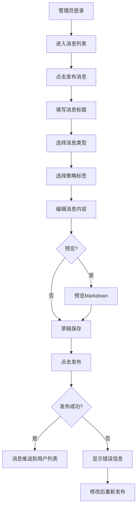
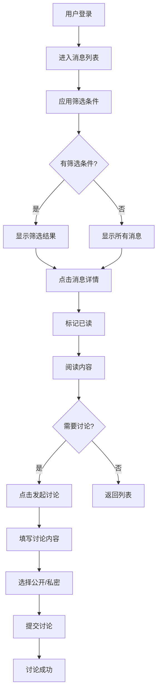
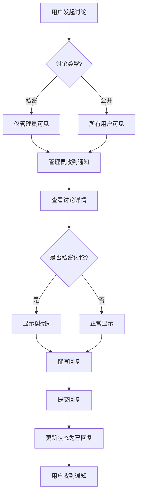
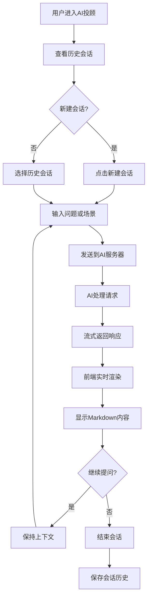
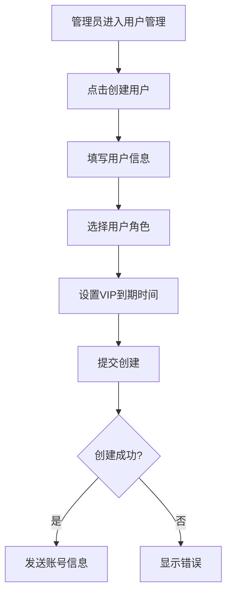

# 04. 业务流程

**模块版本**: v1.6.0
**最后更新**: 2026-02-06
**维护人**: 产品团队

---

## 4.1 消息发布流程

### 4.1.1 流程图



### 4.1.2 详细步骤

| 步骤 | 操作 | 说明 | 系统响应 |
|------|------|------|---------|
| 1 | 管理员登录 | 使用管理员账号登录 | 跳转到消息列表 |
| 2 | 进入发布页面 | 点击"发布消息"按钮 | 显示发布表单 |
| 3 | 填写标题 | 输入消息标题 | 实时字符计数 |
| 4 | 选择类型 | 从10种类型中选择 | 显示对应图标 |
| 5 | 选择标签 | 选择策略标签 | 说明可见用户 |
| 6 | 编辑内容 | 使用Markdown编辑器 | 支持预览 |
| 7 | 预览 | 点击预览按钮 | 切换预览模式 |
| 8 | 发布 | 点击发布按钮 | 提交到服务器 |
| 9 | 成功/失败 | 显示结果 | 成功返回列表 |

### 4.1.3 异常处理

**草稿保存失败**:
- 提示: "草稿保存失败,请重试"
- 自动重试: 3次
- 本地存储: localStorage备份

**发布失败**:
- 提示: "发布失败,请检查网络"
- 保留内容: 不清空表单
- 错误日志: 记录到服务器

---

## 4.2 用户查看消息流程

### 4.2.1 流程图 (v1.6.0更新)



### 4.2.2 筛选使用流程 (v1.6.0新增)

| 步骤 | 操作 | 说明 |
|------|------|------|
| 1 | 点击筛选按钮 | 打开筛选面板 |
| 2 | 选择消息类型 | 一级筛选(10种类型) |
| 3 | 选择策略标签 | 二级筛选(3种标签) |
| 4 | 选择时间范围 | 三级筛选(今天/本周/本月/全部) |
| 5 | 查看结果 | 显示符合筛选条件的消息 |
| 6 | 清除筛选 | 一键恢复显示所有消息 |

**筛选持久化**:
- 自动保存筛选条件
- 下次进入自动应用
- 保留最近10次筛选历史

### 4.2.3 消息可见性规则

```
VIP中线用户:
IF 标签包含 [mid_term] OR [all_users]
THEN 显示该消息

VIP短线用户:
IF 标签包含 [short_term] OR [all_users]
THEN 显示该消息

体验用户/管理员:
显示所有消息
```

---

## 4.3 讨论回复流程

### 4.3.1 流程图 (v1.6.0更新)



### 4.3.2 私密讨论流程 (v1.6.0新增)

**发起私密讨论**:
1. 用户填写讨论内容
2. 选择"私密讨论"选项
3. 提交讨论
4. 系统标记为私密 (visibility='private')
5. 列表中显示🔒图标
6. 仅管理员和发起者可见

**回复私密讨论**:
1. 管理员查看私密讨论
2. 详情页显示"私密讨论"标识
3. 撰写回复内容
4. 提交回复
5. 仅发起者能查看回复

**可见性规则**:
```
IF discussion.visibility == 'public':
    所有用户可见

IF discussion.visibility == 'private':
    IF user.role == 'admin' OR user.id == discussion.userId:
        可见
    ELSE:
        不可见
```

---

## 4.4 AI投顾使用流程 (v1.6.0新增)

### 4.4.1 流程图



### 4.4.2 使用场景

**场景1: 投研咨询**
```
用户: "今天市场有什么风险需要注意?"
AI: [流式输出风险分析]
用户: "中线仓位如何调整?"
AI: [基于上下文继续回答]
```

**场景2: 知识学习**
```
用户: "什么是MACD指标?"
AI: [详细解释MACD]
用户: "有什么使用技巧?"
AI: [继续讲解使用方法]
```

### 4.4.3 技术实现

**SSE流式处理**:
```
前端 → 后端: 发起HTTP请求
后端 → AI: 调用OpenAI API
AI → 后端: 流式返回tokens
后端 → 前端: SSE推送响应
前端: 实时渲染Markdown
```

**错误处理**:
- 网络中断: 自动重连3次
- AI超时: 显示超时提示
- 内容过滤: 敏感词过滤

---

## 4.5 用户管理流程 (管理员)

### 4.5.1 创建用户流程



### 4.5.2 编辑用户流程

| 步骤 | 操作 | 说明 |
|------|------|------|
| 1 | 选择用户 | 从用户列表中选择 |
| 2 | 点击编辑 | 进入编辑页面 |
| 3 | 修改信息 | 角色/状态/到期时间 |
| 4 | 保存修改 | 提交到服务器 |
| 5 | 确认更新 | 显示成功提示 |

---

**变更记录**:
- v1.6.0 (2026-02-06): 更新消息查看流程,添加筛选步骤;新增私密讨论流程;新增AI投顾流程
- v1.0.0 (2024-02-02): 初始版本
