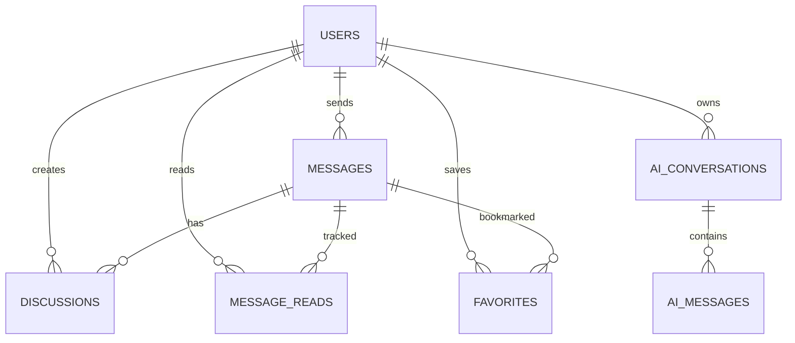

# 05. 数据模型

**模块版本**: v1.6.0
**最后更新**: 2026-02-06
**维护人**: 技术团队

---

## 5.1 用户表 (users)

### 5.1.1 表结构

| 字段 | 类型 | 长度 | 允许NULL | 默认值 | 说明 |
|------|------|------|---------|--------|------|
| id | INT | - | NO | AUTO | 主键 |
| name | VARCHAR | 100 | NO | - | 用户名 |
| email | VARCHAR | 255 | NO | - | 邮箱(唯一) |
| password | VARCHAR | 255 | NO | - | 密码(bcrypt加密) |
| role | ENUM | - | NO | - | 用户角色 |
| groupId | VARCHAR | 50 | YES | NULL | 分组ID |
| status | ENUM | - | NO | 'active' | 状态(active/disabled) |
| expireDate | DATE | - | YES | NULL | VIP到期时间 |
| createdAt | TIMESTAMP | - | NO | NOW() | 创建时间 |
| updatedAt | TIMESTAMP | - | NO | NOW() | 更新时间 |

### 5.1.2 角色枚举值

```javascript
role ENUM(
  'super_admin',  // 超级管理员
  'admin',        // 管理员
  'vip_mid',      // VIP中线用户
  'vip_short',    // VIP短线用户
  'trial'         // 体验用户
)
```

### 5.1.3 索引

```sql
PRIMARY KEY (id)
UNIQUE INDEX idx_email (email)
INDEX idx_role (role)
INDEX idx_status (status)
INDEX idx_expireDate (expireDate)
```

---

## 5.2 消息表 (messages)

### 5.2.1 表结构

| 字段 | 类型 | 长度 | 允许NULL | 默认值 | 说明 |
|------|------|------|---------|--------|------|
| id | INT | - | NO | AUTO | 主键 |
| title | VARCHAR | 255 | NO | - | 消息标题 |
| content | TEXT | - | NO | - | 消息内容(Markdown) |
| type | ENUM | - | NO | - | 消息类型 |
| sender | VARCHAR | 100 | YES | NULL | 发送者名称 |
| senderId | INT | - | YES | NULL | 发送者ID |
| groupId | VARCHAR | 50 | YES | NULL | 分组ID |
| tags | JSON | - | YES | NULL | 标签数组 |
| status | ENUM | - | NO | 'published' | 状态 |
| isPinned | BOOLEAN | - | NO | false | 是否置顶 |
| readCount | INT | - | NO | 0 | 阅读数 |
| discussionCount | INT | - | NO | 0 | 讨论数 |
| createdAt | TIMESTAMP | - | NO | NOW() | 创建时间 |
| updatedAt | TIMESTAMP | - | NO | NOW() | 更新时间 |

### 5.2.2 消息类型枚举值

```javascript
type ENUM(
  'pre_market_comment',  // 盘前点评
  'morning_comment',     // 早盘点评
  'morning_focus',       // 早盘关注
  'afternoon_comment',   // 尾盘点评
  'afternoon_focus',     // 尾盘关注
  'close_comment',       // 收盘点评
  'risk_warning',        // 风险提示
  'system',              // 系统消息
  'important',           // 重要消息
  'daily'                // 日常消息
)
```

### 5.2.3 标签JSON格式

```json
{
  "tags": ["short_term"]  // 或 ["mid_term"] 或 ["all_users"]
}
```

### 5.2.4 索引

```sql
PRIMARY KEY (id)
INDEX idx_type (type)
INDEX idx_status (status)
INDEX idx_createdAt (createdAt)
INDEX idx_senderId (senderId)
FOREIGN KEY (senderId) REFERENCES users(id)
```

---

## 5.3 讨论表 (discussions)

### 5.3.1 表结构

| 字段 | 类型 | 长度 | 允许NULL | 默认值 | 说明 |
|------|------|------|---------|--------|------|
| id | INT | - | NO | AUTO | 主键 |
| messageId | INT | - | NO | - | 关联消息ID |
| userId | INT | - | NO | - | 用户ID |
| userName | VARCHAR | 100 | NO | - | 用户名 |
| title | VARCHAR | 255 | NO | - | 讨论标题 |
| content | TEXT | - | NO | - | 讨论内容 |
| status | ENUM | - | NO | 'pending' | 状态 |
| visibility | ENUM | - | NO | 'public' | 可见性 |
| replyContent | TEXT | - | YES | NULL | 回复内容 |
| repliedAt | TIMESTAMP | - | YES | NULL | 回复时间 |
| createdAt | TIMESTAMP | - | NO | NOW() | 创建时间 |
| updatedAt | TIMESTAMP | - | NO | NOW() | 更新时间 |

### 5.3.2 状态枚举值

```javascript
status ENUM(
  'pending',  // 待回复
  'replied'   // 已回复
)

visibility ENUM(
  'public',   // 公开讨论
  'private'   // 私密讨论 (v1.6.0新增)
)
```

### 5.3.3 索引

```sql
PRIMARY KEY (id)
INDEX idx_messageId (messageId)
INDEX idx_userId (userId)
INDEX idx_status (status)
INDEX idx_visibility (visibility)
INDEX idx_createdAt (createdAt)
FOREIGN KEY (messageId) REFERENCES messages(id)
FOREIGN KEY (userId) REFERENCES users(id)
```

---

## 5.4 消息阅读记录表 (message_reads)

### 5.4.1 表结构 (v1.4.0新增)

| 字段 | 类型 | 长度 | 允许NULL | 默认值 | 说明 |
|------|------|------|---------|--------|------|
| id | INT | - | NO | AUTO | 主键 |
| messageId | INT | - | NO | - | 消息ID |
| userId | INT | - | NO | - | 用户ID |
| readAt | TIMESTAMP | - | NO | NOW() | 阅读时间 |

### 5.4.2 索引

```sql
PRIMARY KEY (id)
UNIQUE INDEX idx_message_user (messageId, userId)
INDEX idx_userId (userId)
FOREIGN KEY (messageId) REFERENCES messages(id)
FOREIGN KEY (userId) REFERENCES users(id)
```

---

## 5.5 收藏表 (favorites)

### 5.5.1 表结构

| 字段 | 类型 | 长度 | 允许NULL | 默认值 | 说明 |
|------|------|------|---------|--------|------|
| id | INT | - | NO | AUTO | 主键 |
| userId | INT | - | NO | - | 用户ID |
| messageId | INT | - | NO | - | 消息ID |
| createdAt | TIMESTAMP | - | NO | NOW() | 收藏时间 |

### 5.5.2 索引

```sql
PRIMARY KEY (id)
UNIQUE INDEX idx_user_message (userId, messageId)
INDEX idx_userId (userId)
FOREIGN KEY (userId) REFERENCES users(id)
FOREIGN KEY (messageId) REFERENCES messages(id)
```

---

## 5.6 AI会话表 (ai_conversations)

### 5.6.1 表结构 (v1.6.0新增)

| 字段 | 类型 | 长度 | 允许NULL | 默认值 | 说明 |
|------|------|------|---------|--------|------|
| id | INT | - | NO | AUTO | 主键 |
| userId | INT | - | NO | - | 用户ID |
| title | VARCHAR | 255 | YES | NULL | 会话标题 |
| createdAt | TIMESTAMP | - | NO | NOW() | 创建时间 |
| updatedAt | TIMESTAMP | - | NO | NOW() | 更新时间 |

### 5.6.2 索引

```sql
PRIMARY KEY (id)
INDEX idx_userId (userId)
INDEX idx_updatedAt (updatedAt)
FOREIGN KEY (userId) REFERENCES users(id)
```

---

## 5.7 AI消息表 (ai_messages)

### 5.7.1 表结构 (v1.6.0新增)

| 字段 | 类型 | 长度 | 允许NULL | 默认值 | 说明 |
|------|------|------|---------|--------|------|
| id | INT | - | NO | AUTO | 主键 |
| conversationId | INT | - | NO | - | 会话ID |
| role | ENUM | - | NO | - | 角色(user/assistant) |
| content | TEXT | - | NO | - | 消息内容 |
| createdAt | TIMESTAMP | - | NO | NOW() | 创建时间 |

### 5.7.2 角色枚举值

```javascript
role ENUM(
  'user',       // 用户消息
  'assistant'   // AI回复
)
```

### 5.7.3 索引

```sql
PRIMARY KEY (id)
INDEX idx_conversationId (conversationId)
INDEX idx_createdAt (createdAt)
FOREIGN KEY (conversationId) REFERENCES ai_conversations(id)
```

---

## 5.8 数据关系图



---

**变更记录**:
- v1.6.0 (2026-02-06): 新增AI会话表和AI消息表;讨论表新增visibility字段
- v1.4.0 (2025-02-01): 新增消息阅读记录表
- v1.0.0 (2024-02-02): 初始版本
