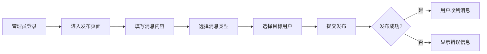
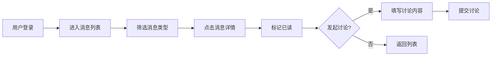

# 需求文档 (REQUIREMENTS.md)

## 1. 产品概述

### 1.1 产品定位

VIP投研内部分享系统是一个面向高端用户的私密投研知识分享平台，专注于提供：
- 系统的研究方法论
- 深度的案例分析
- 专业的市场解读
- 及时的风险提示

### 1.2 目标用户

| 用户类型 | 特征 | 需求 |
|---------|------|------|
| 超级管理员 | 系统运营者 | 系统配置、用户管理、数据监控 |
| 管理员 | 投研专家 | 发布投研消息、回复用户讨论 |
| VIP用户（中线） | 中长期投资者 | 获取中线策略分析 |
| VIP用户（短线） | 短线交易者 | 获取短线策略分析 |
| 体验用户 | 潜在客户 | 了解平台价值，转化为付费用户 |

### 1.3 使用场景

- **早晨**: 查看盘前点评、早盘关注，制定当日交易计划
- **盘中**: 获取实时市场解读和风险提示
- **收盘**: 回顾收盘点评，总结当日操作
- **随时**: 发起讨论，与投研团队互动交流

## 2. 功能需求

### 2.1 核心功能（MVP）

#### 2.1.1 用户认证与权限管理

**用户注册/登录**
- [x] 邮箱密码登录
- [x] JWT Token认证
- [x] 自动登录（Token持久化）
- [x] 登录过期提示

**用户角色**
- [x] 5级用户角色：super_admin、admin、vip_mid、vip_short、trial
- [x] 角色权限控制
- [x] 用户状态管理（正常/禁用）
- [x] VIP到期时间管理

**权限矩阵**

| 功能 | super_admin | admin | vip_mid | vip_short | trial |
|------|-------------|-------|---------|-----------|-------|
| 发布消息 | ✓ | ✓ | ✗ | ✗ | ✗ |
| 查看所有消息 | ✓ | ✓ | - | - | ✓ |
| 查看中线策略 | ✓ | ✓ | ✓ | ✗ | ✓ |
| 查看短线策略 | ✓ | ✓ | ✗ | ✓ | ✓ |
| 发起讨论 | ✓ | ✓ | ✓ | ✓ | ✓ |
| 用户管理 | ✓ | ✗ | ✗ | ✗ | ✗ |
| 数据统计 | ✓ | ✓ | ✗ | ✗ | ✗ |

#### 2.1.2 消息系统

**消息类型**
```
- 盘前点评 (pre_market_comment)
- 早盘点评 (morning_comment)
- 早盘关注 (morning_focus)
- 尾盘点评 (afternoon_comment)
- 尾盘关注 (afternoon_focus)
- 收盘点评 (close_comment)
- 风险提示 (risk_warning)
- 系统消息 (system)
- 重要消息 (important)
- 日常消息 (daily)
```

**消息标签**
```
- 短线策略 (short_term) - 仅VIP短线用户可见
- 中线策略 (mid_term) - 仅VIP中线用户可见
- 全部用户 (all_users) - 所有用户可见
```

**消息功能**
- [x] 消息列表（分页加载、下拉刷新）
- [x] 消息详情（富文本内容展示）
- [x] 消息搜索（标题、内容关键词）
- [x] 标签筛选（按策略类型）
- [x] 消息收藏/取消收藏
- [x] 已读状态标记
- [x] 阅读数、讨论数统计
- [ ] 消息编辑、删除（管理员）
- [ ] 消息置顶
- [ ] 消息草稿保存

#### 2.1.3 讨论系统

**讨论功能**
- [x] 发起讨论（公开/私密）
- [x] 讨论列表
- [x] 讨论详情
- [x] 回复讨论
- [x] 查看回复列表
- [x] 讨论状态（待回复/已回复）
- [x] 我的讨论

**可见性控制**
- 公开讨论：所有用户可见
- 私密讨论：仅管理员和发起者可见

#### 2.1.4 用户管理（管理员功能）

- [x] 用户列表（分页、搜索）
- [x] 创建用户
- [x] 编辑用户（角色、状态、到期时间）
- [x] 删除用户
- [ ] 批量操作
- [ ] 用户分组管理

#### 2.1.5 数据统计（管理员功能）

- [x] 用户增长趋势
- [x] 消息发布统计
- [x] 活跃用户列表
- [ ] 数据导出（Excel）
- [ ] 自定义时间段查询

#### 2.1.6 个人中心

- [x] 个人信息展示
- [x] 我的收藏
- [x] 我的讨论
- [ ] 修改密码
- [ ] 消息通知设置
- [ ] 阅读偏好设置（字体大小、主题）

### 2.2 高级功能（规划中）

#### 2.2.1 消息推送
- [ ] 微信小程序订阅消息
- [ ] 重要消息实时推送
- [ ] 推送开关设置

#### 2.2.2 内容增强
- [ ] 富文本编辑器（支持图片、格式）
- [ ] 消息附件（PDF、Word、Excel）
- [ ] 图片预览、放大

#### 2.2.3 数据分析
- [ ] 阅读时长统计
- [ ] 用户行为分析
- [ ] 消息效果分析

#### 2.2.4 社交功能
- [ ] 用户互相关注
- [ ] 消息分享（仅限内部）
- [ ] 点赞、评论

#### 2.2.5 离线功能
- [ ] 离线阅读已缓存消息
- [ ] 离线发布（待联网后同步）

## 3. 非功能需求

### 3.1 性能要求

- **首屏加载时间**: < 2秒
- **页面切换**: < 500ms
- **列表滚动**: 60fps 流畅
- **接口响应**: < 1秒

### 3.2 安全要求

- [x] JWT Token认证
- [x] 密码加密存储（bcrypt）
- [x] SQL注入防护（Sequelize ORM）
- [x] XSS防护
- [ ] HTTPS加密传输
- [ ] 接口频率限制
- [ ] 敏感操作二次确认

### 3.3 可用性要求

- **系统可用性**: 99.5%
- **错误率**: < 0.1%
- **兼容性**:
  - iOS >= 12.0
  - Android >= 6.0
  - 微信小程序基础库 >= 2.10.0

### 3.4 可维护性

- [x] 模块化代码结构
- [x] 统一的代码风格（ESLint + Prettier）
- [x] 详细的注释文档
- [x] Git版本控制
- [ ] 单元测试覆盖率 > 80%

### 3.5 可扩展性

- [x] 前后端分离架构
- [x] RESTful API设计
- [ ] 微服务架构（预留）
- [ ] 数据库读写分离（预留）

## 4. 业务流程

### 4.1 消息发布流程



### 4.2 用户查看消息流程



### 4.3 讨论回复流程


## 5. 数据模型

### 5.1 用户表 (users)

| 字段 | 类型 | 说明 | 约束 |
|------|------|------|------|
| id | INT | 主键 | PRIMARY KEY |
| name | VARCHAR(100) | 用户名 | NOT NULL |
| email | VARCHAR(255) | 邮箱 | UNIQUE, NOT NULL |
| password | VARCHAR(255) | 密码（加密） | NOT NULL |
| role | ENUM | 用户角色 | NOT NULL |
| groupId | VARCHAR(50) | 分组ID | |
| status | ENUM | 状态 | DEFAULT 'active' |
| expireDate | DATE | VIP到期时间 | |
| createdAt | TIMESTAMP | 创建时间 | DEFAULT NOW() |
| updatedAt | TIMESTAMP | 更新时间 | DEFAULT NOW() |

### 5.2 消息表 (messages)

| 字段 | 类型 | 说明 | 约束 |
|------|------|------|------|
| id | INT | 主键 | PRIMARY KEY |
| title | VARCHAR(255) | 消息标题 | NOT NULL |
| content | TEXT | 消息内容 | NOT NULL |
| type | ENUM | 消息类型 | NOT NULL |
| sender | VARCHAR(100) | 发送者名称 | |
| senderId | INT | 发送者ID | FOREIGN KEY |
| groupId | VARCHAR(50) | 分组ID | |
| tags | JSON | 标签数组 | |
| status | ENUM | 状态 | DEFAULT 'published' |
| readCount | INT | 阅读数 | DEFAULT 0 |
| discussionCount | INT | 讨论数 | DEFAULT 0 |
| createdAt | TIMESTAMP | 创建时间 | DEFAULT NOW() |
| updatedAt | TIMESTAMP | 更新时间 | DEFAULT NOW() |

### 5.3 讨论表 (discussions)

| 字段 | 类型 | 说明 | 约束 |
|------|------|------|------|
| id | INT | 主键 | PRIMARY KEY |
| messageId | INT | 关联消息ID | FOREIGN KEY |
| userId | INT | 用户ID | FOREIGN KEY |
| userName | VARCHAR(100) | 用户名 | |
| title | VARCHAR(255) | 讨论标题 | NOT NULL |
| content | TEXT | 讨论内容 | NOT NULL |
| status | ENUM | 状态 | DEFAULT 'pending' |
| visibility | ENUM | 可见性 | DEFAULT 'public' |
| createdAt | TIMESTAMP | 创建时间 | DEFAULT NOW() |
| updatedAt | TIMESTAMP | 更新时间 | DEFAULT NOW() |

## 6. 界面需求

### 6.1 页面结构

```
├── 登录页 (login)
├── 消息中心 (messages) [TabBar]
├── 讨论区 (discussions) [TabBar]
├── 个人中心 (profile) [TabBar]
├── 消息详情 (message-detail)
├── 讨论详情 (discussion-detail)
├── 发布消息 (create-message) [管理员]
├── 发起讨论 (create-discussion)
├── 我的收藏 (favorites)
├── 我的讨论 (my-discussions)
├── 用户管理 (user-management) [管理员]
└── 数据统计 (stats) [管理员]
```

### 6.2 设计风格

- **色彩体系**: 紫色渐变主题 (#667eea → #764ba2)
- **设计语言**: 简洁、专业、高端
- **交互特点**: 流畅、直观、反馈及时

### 6.3 响应式要求

- 支持H5、微信小程序、支付宝小程序
- 适配不同屏幕尺寸
- 保持一致的视觉体验

## 7. 业务规则

### 7.1 消息可见性规则

```
VIP中线用户：
- 可见标签包含 [mid_term] 或 [all_users] 的消息

VIP短线用户：
- 可见标签包含 [short_term] 或 [all_users] 的消息

体验用户/管理员：
- 可见所有消息
```

### 7.2 讨论可见性规则

```
公开讨论：
- 所有用户可见

私密讨论：
- 仅管理员和讨论发起者可见
```

### 7.3 VIP到期规则

```
体验用户：
- 默认7天试用期
- 到期后账号自动禁用
- 需管理员续期或升级为正式用户
```

## 8. 验收标准

### 8.1 功能验收

- 所有P0功能100%实现
- 所有P1功能90%实现
- 所有P2功能70%实现

### 8.2 性能验收

- 首屏加载时间 < 2秒
- 接口响应时间 < 1秒
- 无内存泄漏
- 无明显卡顿

### 8.3 安全验收

- 通过安全测试（SQL注入、XSS等）
- 敏感数据加密存储
- 权限控制无漏洞

### 8.4 兼容性验收

- iOS Safari兼容
- Android Chrome兼容
- 微信小程序兼容
- 支付宝小程序兼容

## 9. 发布计划

### 9.1 版本规划

**v1.0.0** (当前版本)
- [x] 基础功能实现
- [x] 消息、讨论、用户管理
- [x] 多端支持

**v1.1.0** (优化版)
- [ ] UI/UX优化
- [ ] 性能优化
- [ ] Bug修复

**v1.2.0** (增强版)
- [ ] 消息推送
- [ ] 富文本编辑
- [ ] 数据导出

**v2.0.0** (专业版)
- [ ] AI智能推荐
- [ ] 数据分析
- [ ] 社交功能

## 10. 附录

### 10.1 术语表

| 术语 | 说明 |
|------|------|
| VIP中线 | 专注于中长期投资策略的用户 |
| VIP短线 | 专注于短线交易策略的用户 |
| 盘前点评 | 开盘前的市场分析 |
| 早盘关注 | 开盘后的重点关注 |
| 私密讨论 | 仅特定用户可见的讨论 |

### 10.2 参考文档

- [技术架构文档](./DEVELOPMENT.md)
- [UI设计规范](./DESIGN.md)
- [优化方案](./OPTIMIZATION.md)
- [问题追踪](./ISSUES.md)

---

**文档版本**: v1.0.0
**最后更新**: 2024-02-02
**维护人**: 产品团队
