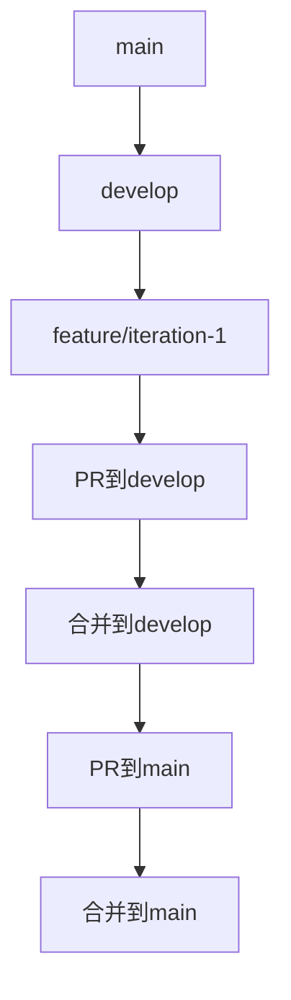
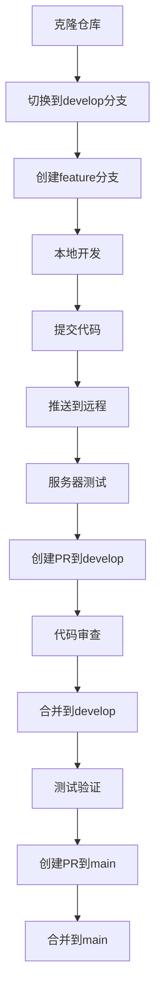

# AITY-VIP 项目代码协作与部署指南

## 📋 目录

1. [项目分支管理现状](#项目分支管理现状)
2. [核心概念](#核心概念)
3. [代码协作流程](#代码协作流程)
4. [服务器部署流程](#服务器部署流程)
5. [分支管理策略](#分支管理策略)
6. [具体操作指南](#具体操作指南)
7. [最佳实践建议](#最佳实践建议)
8. [常见问题解答](#常见问题解答)
9. [后续迭代指导](#后续迭代指导)

---

## 项目分支管理现状

### 当前分支情况

| 分支类型 | 分支名称 | 状态 | 用途 |
|----------|----------|------|------|
| 主分支 | `main` | 远程存在 | 稳定版本，用于生产环境 |
| 开发分支 | `develop` | 远程存在 | 集成开发，用于测试环境 |
| 功能分支 | `feature/iteration-1` | 远程存在（当前分支） | 第一期迭代功能开发 |

### 分支关系



---

## 核心概念

### 代码协作相关概念

| 概念 | 描述 |
|------|------|
| **PR（Pull Request）** | 从功能分支向主分支提交代码合并请求的过程 |
| **分支（Branch）** | 项目的不同开发线，如 `main`、`develop`、`feature/*` 等 |
| **推送（Push）** | 将本地代码上传到远程仓库（GitHub） |
| **拉取（Pull）** | 从远程仓库下载代码到本地或服务器 |
| **合并（Merge）** | 将一个分支的代码合并到另一个分支 |

### 服务器部署相关概念

| 概念 | 描述 |
|------|------|
| **仓库地址** | AITY-VIP 项目的 GitHub 地址：`https://github.com/AILHJJ/aity-vip.git` |
| **分支地址** | 特定分支的引用，如 `origin/feature/iteration-1` |
| **部署环境** | 代码运行的环境，如测试环境、生产环境 |
| **持续集成/持续部署（CI/CD）** | 自动化构建、测试和部署的流程 |

---

## 代码协作流程

### AITY-VIP 项目开发流程



### 详细步骤说明

1. **克隆仓库**
   ```bash
   git clone https://github.com/AILHJJ/aity-vip.git
   cd aity-vip
   ```

2. **创建功能分支**
   ```bash
   # 从develop分支创建功能分支
   git checkout develop
   git pull origin develop
   git checkout -b feature/iteration-1
   ```

3. **本地开发**
   - 编写代码（前端/backend目录）
   - 运行测试
   - 确保代码质量

4. **提交代码**
   ```bash
   git add .
   git commit -m "feat: 实现XXX功能"
   ```

5. **推送到远程**
   ```bash
   git push origin feature/iteration-1
   ```

6. **服务器测试**
   - 服务器拉取 `feature/iteration-1` 分支进行测试
   - 验证功能是否正常运行

7. **创建PR**
   - 在 GitHub 上创建从 `feature/iteration-1` 到 `develop` 的 PR
   - 填写详细的 PR 描述，包括实现的功能和测试结果
   - 等待代码审查

8. **代码审查与合并**
   - 团队成员审查代码
   - 解决审查中提出的问题
   - 审查通过后合并到 `develop` 分支

---

## 服务器部署流程

### 部署方案对比

| 方案 | 适用场景 | 优点 | 缺点 |
|------|----------|------|------|
| 直接拉取功能分支 | AITY-VIP 测试环境、预览环境 | 快速获取最新代码，无需等待PR | 代码可能不稳定 |
| 拉取稳定分支 | AITY-VIP 生产环境 | 代码经过测试和审查，稳定可靠 | 需要等待PR合并 |

### 方案一：直接拉取功能分支（测试环境）

**适用场景**：腾讯云服务器拉取 `feature/iteration-1` 分支进行测试

**操作步骤**：

1. **登录腾讯云服务器**

2. **进入项目目录**
   ```bash
   cd /path/to/aity-vip
   ```

3. **拉取远程仓库信息**
   ```bash
   git fetch origin
   ```

4. **切换到功能分支**
   ```bash
   # 首次拉取
   git checkout -b feature/iteration-1 origin/feature/iteration-1
   
   # 或更清晰的写法
   git checkout -t origin/feature/iteration-1
   ```

5. **后续更新**
   ```bash
   # 在功能分支下执行
   git pull origin feature/iteration-1
   ```

### 方案二：拉取稳定分支（生产环境）

**适用场景**：部署经过测试和合并的稳定代码

**操作步骤**：

1. **登录腾讯云服务器**

2. **进入项目目录**
   ```bash
   cd /path/to/aity-vip
   ```

3. **切换到稳定分支**
   ```bash
   git checkout develop
   ```

4. **拉取最新代码**
   ```bash
   git pull origin develop
   ```

### AITY-VIP 项目部署后操作

无论采用哪种部署方案，部署后都需要执行以下操作：

1. **前端构建**
   ```bash
   # 进入前端目录
   cd frontend
   npm install
   npm run build
   ```

2. **后端启动**
   ```bash
   # 进入后端目录
   cd ../backend
   npm install
   npm start
   ```

3. **服务状态检查**
   ```bash
   # 检查服务是否正常运行
   curl http://localhost:3000/api/health
   ```

4. **数据库初始化**（首次部署）
   ```bash
   # 进入后端目录
   cd backend
   node scripts/create-test-data.js
   ```

---

## 分支管理策略

### 分支类型与用途

| 分支类型 | 命名格式 | 用途 | 示例 |
|----------|----------|------|------|
| 主分支 | `main` | 稳定版本，用于生产环境 | `main` |
| 开发分支 | `develop` | 集成开发，用于测试环境 | `develop` |
| 功能分支 | `feature/iteration-X` | 第X期迭代功能开发 | `feature/iteration-1` |
| 修复分支 | `fix/XXX` | 修复bug | `fix/auth-error` |
| 紧急修复分支 | `hotfix/XXX` | 紧急修复生产环境问题 | `hotfix/crash-fix` |

### 分支生命周期

1. **创建**：从 `develop` 分支创建功能分支
2. **开发**：在功能分支上进行开发和提交
3. **推送**：将功能分支推送到远程仓库
4. **测试**：服务器拉取功能分支进行测试
5. **PR**：创建PR到 `develop` 分支
6. **合并**：PR通过后合并到 `develop` 分支
7. **删除**：功能完成后删除功能分支

### AITY-VIP 项目分支管理规范

1. **功能分支命名**：`feature/iteration-X`，其中 X 为迭代版本号
2. **修复分支命名**：`fix/问题描述`，如 `fix/login-error`
3. **分支创建**：所有功能分支必须从 `develop` 分支创建
4. **分支合并**：功能完成后必须通过PR合并到 `develop` 分支
5. **分支清理**：PR合并后删除对应的功能分支

---

## 具体操作指南

### 本地开发操作指南

#### 1. 初始化开发环境

```bash
# 克隆仓库
git clone https://github.com/AILHJJ/aity-vip.git
cd aity-vip

# 安装前端依赖
cd frontend
npm install

# 安装后端依赖
cd ../backend
npm install
```

#### 2. 日常开发流程

```bash
# 1. 确保在正确的分支上
git checkout feature/iteration-1

# 2. 拉取最新代码（避免冲突）
git pull origin feature/iteration-1

# 3. 开发代码...

# 4. 查看修改
git status

# 5. 提交代码
git add .
git commit -m "feat: 实现XXX功能"

# 6. 推送到远程
git push origin feature/iteration-1
```

### 服务器操作指南

#### 1. 首次部署（测试环境）

```bash
# 1. 克隆仓库
git clone https://github.com/AILHJJ/aity-vip.git
cd aity-vip

# 2. 切换到功能分支
git checkout -b feature/iteration-1 origin/feature/iteration-1

# 3. 安装依赖并构建
# 前端
cd frontend
npm install
npm run build

# 后端
cd ../backend
npm install

# 4. 初始化测试数据
node scripts/create-test-data.js

# 5. 启动服务
npm start
```

#### 2. 代码更新（测试环境）

```bash
# 1. 进入项目目录
cd /path/to/aity-vip

# 2. 切换到功能分支
git checkout feature/iteration-1

# 3. 拉取最新代码
git pull origin feature/iteration-1

# 4. 更新依赖并重新构建
# 前端
cd frontend
npm install
npm run build

# 后端
cd ../backend
npm install

# 5. 重启服务
npm restart
```

#### 3. 生产环境部署

```bash
# 1. 进入项目目录
cd /path/to/aity-vip

# 2. 切换到稳定分支
git checkout develop

# 3. 拉取最新代码
git pull origin develop

# 4. 安装依赖并构建
# 前端
cd frontend
npm install
npm run build

# 后端
cd ../backend
npm install

# 5. 重启服务
npm restart
```

---

## 最佳实践建议

### 代码协作最佳实践

1. **提交信息规范**
   - 使用语义化提交信息：`feat: 实现XXX功能`、`fix: 修复XXX问题`
   - 提交信息简洁明了，描述清楚变更内容
   - 重大变更应在提交信息中详细说明

2. **代码审查规范**
   - 每次PR至少有1人审查
   - 审查重点：代码质量、功能完整性、安全性
   - 审查时间：PR创建后24小时内完成审查

3. **分支管理规范**
   - 功能分支命名清晰：`feature/iteration-X`
   - 定期清理过期分支（每月一次）
   - 保持分支结构简洁，避免过多并行分支

### 部署最佳实践

1. **环境隔离**
   - 测试环境：使用 `feature/iteration-X` 分支
   - 生产环境：使用 `develop` 或 `main` 分支

2. **部署自动化**
   - 使用项目中的 `scripts/deploy.sh` 脚本自动化部署流程
   - 配置CI/CD pipeline，实现代码提交后自动部署测试环境

3. **监控与回滚**
   - 部署后监控服务状态，确保API正常响应
   - 准备回滚方案，保留前一个稳定版本的代码和构建产物
   - 记录每次部署的版本信息，便于问题追踪

4. **版本管理**
   - 每次迭代完成后创建版本标签，如 `v1.0.0`
   - 维护更新日志，记录每次迭代的功能变更
   - 定期备份代码仓库，确保代码安全

---

## 常见问题解答

### 1. PR是必须的吗？

- **对于代码合并到 `develop` 或 `main` 分支是必须的**：保证代码质量，经过审查后才能合并
- **对于服务器拉取代码不是必须的**：服务器可以直接拉取任何存在的分支，包括 `feature/iteration-1`

### 2. 服务器能直接拉取 `feature/iteration-1` 分支吗？

- **当然可以！** 只要这个分支已经推送到 GitHub（即 `origin/feature/iteration-1` 存在），服务器就可以直接拉取它

### 3. 直接用 `https://github.com/AILHJJ/aity-vip.git` 这个链接不行吗？

- 这个链接是**仓库地址**，不是**分支地址**。拉取时需要指定分支名
- 例如：`git pull origin feature/iteration-1`

### 4. 如何解决部署时的依赖问题？

- **锁定依赖版本**：使用 `package-lock.json` 确保依赖版本一致
- **环境一致性**：确保服务器环境与开发环境的Node.js版本一致
- **依赖缓存**：使用npm缓存减少部署时间

### 5. 如何处理部署失败的情况？

- **查看日志**：分析部署失败的原因
- **回滚操作**：切换到之前的稳定版本
- **逐步部署**：先在测试环境验证，再部署到生产环境
- **备份数据**：部署前备份数据库，以防数据丢失

---

## 后续迭代指导

### 迭代流程

1. **迭代规划**：确定下一期迭代的功能和目标
2. **分支创建**：从 `develop` 分支创建新的功能分支 `feature/iteration-2`
3. **开发测试**：按照当前流程进行开发和测试
4. **PR合并**：完成后通过PR合并到 `develop` 分支
5. **版本发布**：测试通过后合并到 `main` 分支发布

### 版本管理

| 版本类型 | 格式 | 示例 | 用途 |
|----------|------|------|------|
| 开发版本 | `vX.Y.Z-dev` | `v1.1.0-dev` | 开发过程中的版本标识 |
| 测试版本 | `vX.Y.Z-beta` | `v1.1.0-beta` | 测试环境的版本标识 |
| 稳定版本 | `vX.Y.Z` | `v1.1.0` | 生产环境的版本标识 |

### 持续集成建议

1. **自动化测试**：配置单元测试和集成测试
2. **代码质量检查**：使用ESLint等工具检查代码质量
3. **构建验证**：确保每次提交都能成功构建
4. **部署自动化**：测试通过后自动部署到测试环境

### 团队协作建议

1. **定期同步**：每周召开团队会议，同步开发进度
2. **文档更新**：及时更新API文档和开发文档
3. **知识共享**：分享开发经验和最佳实践
4. **问题追踪**：使用GitHub Issues跟踪开发过程中的问题

---

## 总结

本指南详细介绍了 AITY-VIP 项目的代码协作流程和服务器部署流程，包括：

- **项目现状**：当前分支管理情况和分支关系
- **代码协作**：从创建分支到PR合并的完整流程
- **服务器部署**：针对AITY-VIP项目的具体部署方案
- **分支管理**：AITY-VIP项目的分支管理规范
- **操作指南**：本地开发和服务器操作的详细步骤
- **最佳实践**：代码协作和部署的推荐做法
- **问题解答**：常见问题的解决方案
- **后续指导**：未来迭代的规划和建议

通过遵循本指南，可以确保 AITY-VIP 项目代码协作的高效性和部署的可靠性，为项目的持续迭代和维护提供有力支持。

---

> 📅 **最后更新**：2026-02-03
> 📝 **文档作者**：AITY-VIP 开发团队
> 🔗 **相关链接**：
> - [项目仓库](https://github.com/AILHJJ/aity-vip.git)
> - [API文档](docs/core/API文档.md)
> - [开发指南](docs/core/开发指南.md)
> - [部署手册](docs/core/部署手册.md)