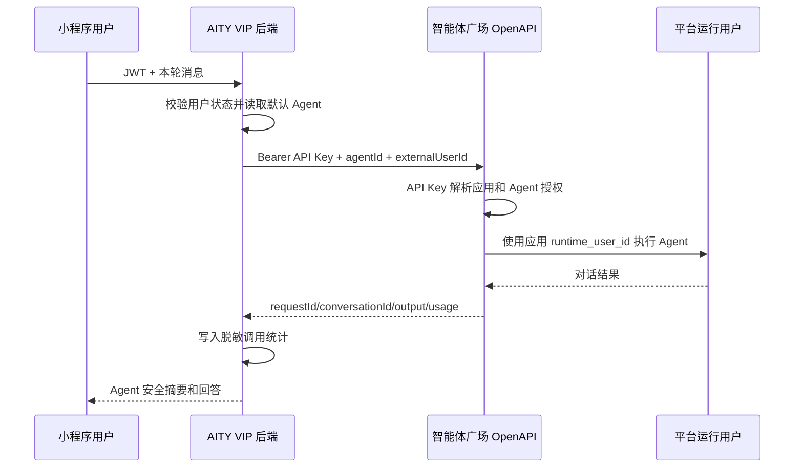

# Agent 对话接入与调用统计设计

> 更新时间：2026-09-09
>
> 目标读者：产品、开发、测试和运维人员。读完后应能按本文实现、验收并发布 AITY VIP 小程序的 Agent 对话能力。

## 为什么现在要做

AITY VIP 当前小程序的 AI 页面仍使用旧的“图灵/问小达”代理链路，并在前端固定传递 `agent: wenda`。项目现在已有智能体广场封装好的 OpenAPI 对话接口和应用级鉴权密钥，应改为由 AITY VIP 后端调用 OpenAPI，动态查询当前应用获授权的 Agent，再向小程序提供安全展示信息。

本次同时补齐按用户统计调用次数的能力。统计仅保存请求标识、用户、Agent、结果和耗时，不保存完整提问或回答，降低金融投研内容进入统计库的合规与隐私风险。

## 核心结论

1. 真实 OpenAPI API Key 只保存在腾讯云后端共享环境配置中，不进入小程序、Git、数据库业务表、接口响应和普通日志。
2. AITY VIP 只调用封装好的 `/openapi/v1/*` 接口，不直接调用底层 MCP。
3. 后端先调用 `GET /openapi/v1/agents` 获取当前应用已授权 Agent，管理员从安全摘要中选择默认 Agent。
4. 小程序统一使用“Agent”作为功能名称，实际名称、简介和图标来自 Agent 查询结果，不写死“图灵”或 `wenda`。
5. 上游 `runtime_user_id` 由智能体广场应用配置内部解析和使用，AITY VIP 不传、不保存、不展示。
6. 每次对话必须先通过 AITY VIP JWT 鉴权；后端以当前用户 ID 生成 `externalUserId`，实现用户会话和统计隔离。

## 方案对比

| 方案 | 做法 | 优点 | 风险 | 结论 |
| --- | --- | --- | --- | --- |
| 前端直连 OpenAPI | 小程序内携带 API Key | 改动少 | 密钥必然泄露，无法接受 | 不采用 |
| 后端固定 Agent | 后端保存 Key 和固定 `agentId` | 实现快 | Agent 名称和授权变更后容易失效 | 仅作为环境变量兜底 |
| 后端动态查询并选择默认 Agent | 后端查询已授权 Agent，管理员选择默认项 | 安全、可维护、支持后续多 Agent | 需要配置和统计表 | 推荐 |

## 目标与非目标

### 目标

- 登录用户可以使用默认 Agent 对话。
- 页面动态显示 Agent 名称和简介。
- 管理员可以刷新已授权 Agent 并选择默认 Agent。
- 管理员看不到也不能从页面读取真实 API Key。
- 管理员可以查看总调用次数和每位用户的使用次数。
- 普通用户可以查看自己的调用次数。
- 上游不可用、密钥无效、Agent 被取消授权时有明确中文提示。

### 非目标

- 本期不直接接入或配置底层 MCP。
- 本期不允许小程序修改 OpenAPI API Key。
- 本期不开放系统提示词、模型配置、运行用户和工具原始结果。
- 本期不做用量计费、限额套餐和按 Token 结算。
- 本期不展示完整调用正文。

## 调用链路



## 配置项

| 配置项 | 所在位置 | 含义 | 是否敏感 |
| --- | --- | --- | --- |
| `AGENT_OPENAPI_BASE_URL` | 腾讯云共享后端环境文件 | OpenAPI 服务地址 | 否 |
| `AGENT_OPENAPI_API_KEY` | 腾讯云共享后端环境文件 | 应用鉴权密钥 | 是 |
| `AGENT_OPENAPI_DEFAULT_AGENT_ID` | 腾讯云共享后端环境文件 | 数据库未选择时的默认 Agent 兜底 | 否 |
| `AGENT_OPENAPI_TIMEOUT_MS` | 腾讯云共享后端环境文件 | 上游请求超时，默认 120000 毫秒 | 否 |

生产环境使用 `/root/aity-vip/shared/backend.env`，由当前 release 的 `backend/.env.production` 链接读取。文档、示例和提交中只写占位符，不记录真实密钥。

## 数据结构

### `agent_settings`

单行配置表，仅保存安全元数据。

| 字段 | 含义 |
| --- | --- |
| `id` | 主键，固定使用系统默认配置记录 |
| `default_agent_id` | 默认 Agent 的稳定标识 |
| `default_agent_name` | Agent 名称快照 |
| `default_agent_description` | Agent 简介快照 |
| `default_agent_icon` | Agent 图标快照 |
| `default_agent_class` | Agent 分类 |
| `updated_by` | 最后修改管理员 |
| `created_at` / `updated_at` | 审计时间 |

### `agent_usage_records`

| 字段 | 含义 |
| --- | --- |
| `request_id` | 单次请求追踪标识 |
| `user_id` | AITY VIP 用户主键 |
| `agent_id` | 调用的 Agent 标识 |
| `agent_name` | 调用时名称快照 |
| `conversation_id` | 上游会话标识，可空 |
| `status` | `success`、`failed` 或 `timeout` |
| `elapsed_ms` | 后端到上游的总耗时 |
| `mcp_calls` | 上游返回的工具调用次数 |
| `error_code` | 脱敏错误码 |
| `created_at` | 调用时间 |

不保存完整请求正文、回答、API Key、运行用户、系统提示词或工具原始结果。

## AITY VIP 接口

| 方法 | 路径 | 权限 | 说明 |
| --- | --- | --- | --- |
| `GET` | `/api/ai-advisor/config` | 登录用户 | 返回默认 Agent 安全摘要和服务状态 |
| `GET` | `/api/ai-advisor/agents` | 管理员 | 从上游查询当前应用已授权 Agent |
| `PUT` | `/api/ai-advisor/config` | 管理员 | 选择默认 Agent，只接受已授权列表中的 `agentId` |
| `POST` | `/api/ai-advisor/chat` | 登录用户 | 调用默认 Agent，返回统一非流式结果 |
| `GET` | `/api/ai-advisor/usage/personal` | 登录用户 | 查询个人调用汇总 |
| `GET` | `/api/ai-advisor/usage` | 管理员 | 查询全局及按用户汇总 |

旧 `/stream-chat` 暂保留为兼容入口，但内部统一走同一服务层；小程序首期切换为非流式接口。现有小程序 `uni.request` 实际也是收到完整响应后才解析 SSE，因此首期不会损失真实的逐字流式体验。

## 页面设计

### 用户 Agent 页

```text
┌──────────────────────────────┐
│ 返回   Agent                 │
├──────────────────────────────┤
│ [图标] 实际 Agent 名称       │
│        Agent 简介            │
├──────────────────────────────┤
│ 对话内容                     │
│                              │
├──────────────────────────────┤
│ 新会话   输入问题       发送 │
└──────────────────────────────┘
```

### 管理员 Agent 配置页

- 显示服务状态：已配置、未配置、上游异常。
- 显示已授权 Agent 列表。
- 当前默认 Agent 使用明确选中状态。
- 点击“设为默认”立即保存，不提供 API Key 输入框。
- 显示总调用、今日调用、成功率及按用户调用次数。

## 异常处理

| 场景 | 用户提示 | 管理员可见信息 |
| --- | --- | --- |
| 未配置 API Key | `Agent 服务暂未配置` | 明确显示环境配置缺失 |
| API Key 无效或过期 | `Agent 服务认证失败，请联系管理员` | 上游 HTTP 状态和脱敏错误码 |
| 默认 Agent 被取消授权 | `当前 Agent 暂不可用` | 要求重新选择默认 Agent |
| 请求超时 | `Agent 响应超时，请稍后重试` | `timeout` 统计和耗时 |
| 用户登录过期 | `登录已过期，请重新登录` | 不调用上游 |
| 用户账号到期 | `账号已到期，请联系管理员续期` | 不调用上游 |

## 测试与验收

| 测试项 | 验收标准 |
| --- | --- |
| 密钥安全 | 全仓扫描无真实 API Key；接口和日志不返回密钥 |
| Agent 查询 | 只返回 `agentId`、名称、简介、图标和分类 |
| 默认配置 | 只能选择当前应用已授权 Agent |
| 鉴权 | 未登录、登录过期和账号到期都不会调用上游 |
| 对话 | 当前用户可获得默认 Agent 回答和请求标识 |
| 用户隔离 | `externalUserId` 来自当前 JWT 用户，前端不能伪造 |
| 统计 | 成功、失败、超时都记录；个人只能看本人，管理员看全局 |
| 小程序 | 页面显示动态 Agent 名称，微信小程序构建通过 |
| H5 | 与小程序共用代码并通过构建 |

## 风险与回滚

| 风险 | 控制措施 | 回滚方式 |
| --- | --- | --- |
| 上游接口尚未部署或 Base URL 配错 | 发布前先用服务端只读 Agent 查询验证 | 回滚后端 release，旧小程序入口暂不可用 |
| Agent 授权变化 | 每次管理员刷新时重新校验，调用前校验默认项 | 重新选择 Agent 或使用环境兜底值 |
| 新表迁移失败 | 使用幂等迁移并先备份数据库 | 回滚代码；新增表保留，不影响旧业务 |
| 调用量异常 | 按用户统计并预留限流扩展 | 关闭 Agent 入口或撤销 API Key |

## 待确认问题

暂无阻塞问题。上线前仍需由运维确认 OpenAPI Base URL、API Key 已写入腾讯云共享环境配置，并由管理员确认动态查询返回的默认 Agent。

## 落地拆解

| 阶段/任务 | 负责人 | 交付物 | 验收方式 |
| --- | --- | --- | --- |
| 后端服务层 | 后端开发 | OpenAPI 客户端、配置和统计服务 | 单元测试通过 |
| 数据迁移 | 后端/运维 | 两张幂等新表 | 测试库执行成功 |
| 小程序 | 前端开发 | Agent 页面和管理员配置页 | 微信构建和 UI 契约通过 |
| 联调 | 开发/测试 | Agent 查询、对话和统计记录 | 使用测试用户完成真实调用 |
| 发布 | 运维 | 新 release、环境配置和回滚点 | 健康检查与业务检查通过 |
